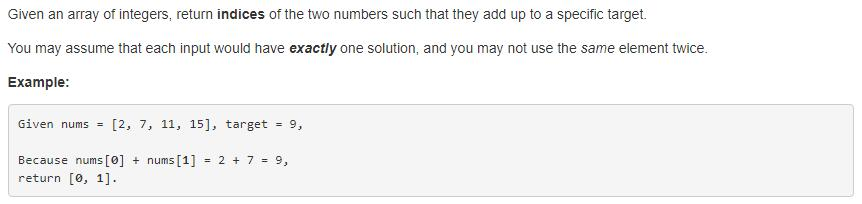

> 点击勘误[issues](https://github.com/webVueBlog/learn-web/issues)，哪吒感谢大家的阅读

[[toc]]

## 1. 题目描述 （简单难度）



给定一个数组和一个目标和，从数组中找两个数字相加等于目标和，输出这两个数字的下标。

给定一个整数数组 nums 和一个整数目标值 target，请你在该数组中找出 和为目标值 target  的那 两个 整数，并返回它们的数组下标。

你可以假设每种输入只会对应一个答案。但是，数组中同一个元素在答案里不能重复出现。

你可以按任意顺序返回答案。

示例 1：

```js
输入：nums = [2,7,11,15], target = 9
输出：[0,1]
解释：因为 nums[0] + nums[1] == 9 ，返回 [0, 1] 。
示例 2：

输入：nums = [3,2,4], target = 6
输出：[1,2]
示例 3：

输入：nums = [3,3], target = 6
输出：[0,1]
```

提示：

```js
2 <= nums.length <= 104
-109 <= nums[i] <= 109
-109 <= target <= 109
```

只会存在一个有效答案

进阶：你可以想出一个时间复杂度小于 O(n2) 的算法吗？

## 2. 解法一

简单粗暴些，两重循环，遍历所有情况看相加是否等于目标和，如果符合直接输出。

```js
/**
 * @param {number[]} nums
 * @param {number} target
 * @return {number[]}
 */
var twoSum = function(nums, target) {

    var map = {};
    for(var i = 0 ; i < nums.length ; i++){
        var v = nums[i];

        for(var j = i+1 ; j < nums.length ; j++ ){
            if(  nums[i] + nums[j]  == target ){
                return [i,j];
            }
        }

    }
};
```

## 进阶

上面双回圈的时间复杂度是O(n^2)，效率明显不太好，用map就可以在一次走访中找到i,j的位置

```js
var twoSum = function(nums, target) {

    var map = {};
    for(var i = 0 ; i < nums.length ; i++){
        var v = nums[i];

        if(map[target-v] >= 0){
            // 如果 target - v可以在map中找到值x，代表之前已經出現過值x， target = x + v
            // 因此回傳 x的位置與目前v的位置  
            return [map[target-v],i]
        } else {
            // 使用map儲存目前的數字與其位置  

            map[v] = i;
        }
    }
};
```

