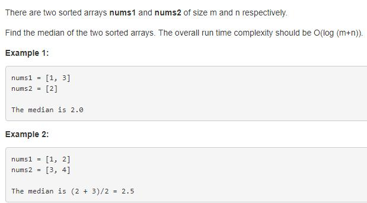

> 点击勘误[issues](https://github.com/webVueBlog/learn-web/issues)，哪吒感谢大家的阅读

[[toc]]

## 1. 题目描述（中等难度）

给定两个大小分别为 m 和 n 的正序（从小到大）数组 nums1 和 nums2。请你找出并返回这两个正序数组的 中位数 。

算法的时间复杂度应该为 O(log (m+n)) 。



已知两个有序数组，找到两个数组合并后的中位数。

## 2. 解法一

简单粗暴，先将两个数组合并，两个有序数组的合并也是归并排序中的一部分。然后根据奇数，还是偶数，返回中位数。

## 前置知识

- 中位数
- 分治法
- 二分查找

## 暴力法

暴力解主要是要 merge 两个排序的数组（A，B）成一个排序的数组。

用两个`pointer（i，j）`，i 从数组A起始位置开始，即i=0开始，j 从数组B起始位置， 即j=0开始. 一一比较 `A[i]` 和 `B[j]`,

- 如果`A[i] <= B[j]`, 则把`A[i]` 放入新的数组中，i 往后移一位，即 i+1.
- 如果`A[i] > B[j]`, 则把`B[j]` 放入新的数组中，j 往后移一位，即 j+1.
- 重复步骤#1 和 #2，直到i移到A最后，或者j移到B最后。
- 如果j移动到B数组最后，那么直接把剩下的所有A依次放入新的数组中.
- 如果i移动到A数组最后，那么直接把剩下的所有B依次放入新的数组中.

## 3. 代码

```js
/**
 * @param {number[]} nums1
 * @param {number[]} nums2
 * @return {number}
 */
var findMedianSortedArrays = function (nums1, nums2) {
  // 归并排序
  const merged = [];
  let i = 0;
  let j = 0;
  while (i < nums1.length && j < nums2.length) {
    if (nums1[i] < nums2[j]) {
      merged.push(nums1[i++]);
    } else {
      merged.push(nums2[j++]);
    }
  }
  while (i < nums1.length) {
    merged.push(nums1[i++]);
  }
  while (j < nums2.length) {
    merged.push(nums2[j++]);
  }

  const { length } = merged;
  return length % 2 === 1
    ? merged[Math.floor(length / 2)]
    : (merged[length / 2] + merged[length / 2 - 1]) / 2;
};
```

## 复杂度分析

- 时间复杂度：$O(max(m, n))$
- 空间复杂度：$O(m + n)$


