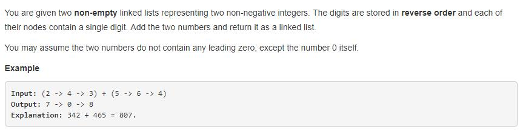
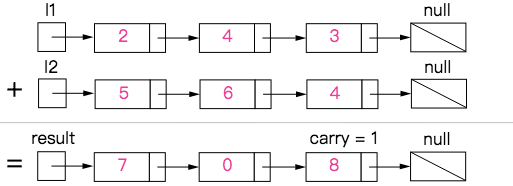
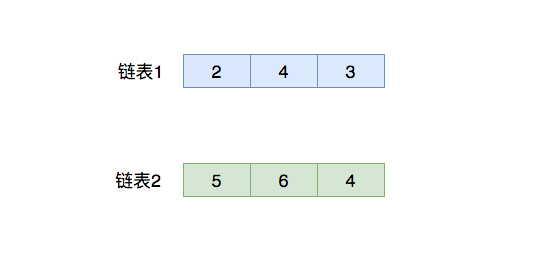
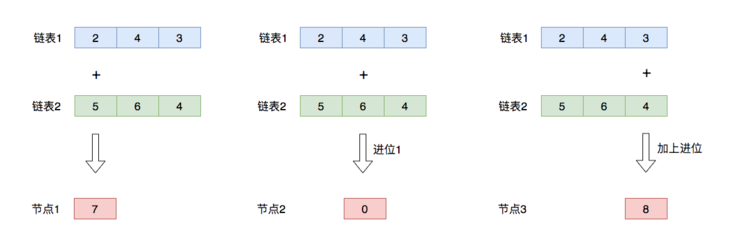
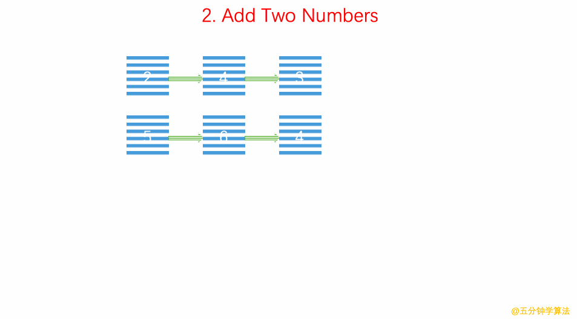

> 点击勘误[issues](https://github.com/webVueBlog/learn-web/issues)，哪吒感谢大家的阅读

[[toc]]

## 1. 题目描述（中等难度）



就是两个链表表示的数相加，这样就可以实现两个很大的数相加了，无需考虑数值 int ，float 的限制了。

由于自己实现的很乱，直接按答案的讲解了。

给你两个链表，代表两个非负数。这些数字以相反的顺序存储，
它们的每个节点都包含一个数字。将两个数字相加并将其作为链表返回。

```js
输入：(2 -> 4 -> 3) + (5 -> 6 -> 4) 输出：7 -> 0 -> 8
```

## 翻译

有两个连结阵列分别代表两个非负整数，他们的位数是反向储存(越前面的节点位数越低)，毎一个节点代表一个位数，将这两个连结阵列加总后以连结阵列形式回传。

```js
范例：
Input: (2 -> 4 -> 3) + (5 -> 6 -> 4)
Output: 个位数为2与5，相加为7 ； 十位数为4+6 = 10，需要进位； 百位数为3 + 4 + 1(进位) = 8，结果为7->0->8
```

## 思路

- 就只是用一个新的linked list来储存相加后的结果
- 要注意的就是list1跟list2长度可能不一样
- 另外就是相加后可能比9还大，需要考虑进位的情况

## 解题

```js
/**
 * Definition for singly-linked list.
 * function ListNode(val) {
 *     this.val = val;
 *     this.next = null;
 * }
 */
/**
 * @param {ListNode} l1
 * @param {ListNode} l2
 * @return {ListNode}
 */
var addTwoNumbers = function(l1, l2) {
    var list = new ListNode(0); //儲存輸出的結果，因為list的指針要不斷往後移，因此用一個假節點方便操作
    var result = list; // 使用一個ListNode來儲存相加的結果

    var sum,carry = 0; // carry用來處理進位

    //當 list1, list2 都沒有值，而且carry也為0的時候才結束迴圈
    while(l1 || l2 || carry > 0){
        sum = 0;

        // list1與list2長度可能不同，分開處理
        if(l1!== null){
            sum += l1.val;
            l1 = l1.next;
        }

        if(l2!==null){
            sum += l2.val;
            l2 = l2.next;
        }

        // 如果之前有進位，carry = 1；沒有的話carry = 0
        sum += carry;
        list.next = new ListNode(sum%10); //相加如果超過9，只能留下個位數放入結果list，十位數的地方進位
        carry = parseInt(sum/10);

        // list指標向後
        list = list.next;
    }
    // 因為第一個節點為假節點，跳過
    return result.next;
}
```

## 用递回解

```js
var addTwoNumbers = function(l1, l2) {

    var list = new ListNode(0);
    var result = list; // 使用一個ListNode來儲存相加的結果

    add(l1,l2,0);
    return result.next;

    function add(l1,l2,gap){
        var sum = 0;
        if(l1 === null && l2 === null && gap === 0){
            return 0;
        } 

        if(l1 !== null){
            sum += l1.val;
            l1 = l1.next;
        } 

        if(l2 !== null){
            sum += l2.val;
            l2 = l2.next;
        }
        sum += gap;
        list.next = new ListNode(sum%10);
        gap = parseInt(sum/10);
        list = list.next;
        add(l1,l2,gap);
    }
};
```



可以用两种做法：循环 + 递归。
​
在实现中需要注意的有：

1. 不可以把链表先转化成 int 型数字再求和，因为可能溢出；
2. 两个「加数」的字符串长度可能不同；
3. 在最后，如果进位 carry 不为 0，那么最后需要计算进位；

代码中的巧妙之处：

- while (i >= 0 || j >= 0 || carry != 0)含义：

链表 a 和 b 只要有一个没遍历完，那么就继续遍历；
如果链表 a 和 b 都遍历完了，但是最后留下的进位 carry != 0，那么需要把进位也保留到结果中。

- 取 a 和 b 当前位置数字 的时候，如果链表 a 或 b 已经遍历完了（即 i < = 0 i <= 0i<=0 或者 j < = 0 j <= 0j<=0），则认为 a 和 b 的对应位置是 0 00 。

给定两个非空链表来表示两个非负整数。位数按照逆序方式存储，它们的每个节点只存储单个数字。将两数相加返回一个新的链表。

你可以假设除了数字 0 之外，这两个数字都不会以零开头。

示例：

```js
输入：(2 -> 4 -> 3) + (5 -> 6 -> 4)
输出：7 -> 0 -> 8
原因：342 + 465 = 807
```



既然是求和，那不难知道，取出两个链表中的每一个节点，然后进行求和(sum)，如果大于10则记一个进位1，然后拿sum对10进行求余，得的到结果就是目标链表的第一个有效节点，具体过程如图：



实现过程：

1、核心方法就是对两个链表进行遍历，然后逐个节点求和

- 因为不知道这两个要求和的链表的节点个数(也就是不知道循环次数)，所以选择while循环。只要任何一个链表的节点不为null，都需要继续进行循环
- 但是因为有进位的情况，所以，当进位不是0时，也不能停止循环（比如9999+1）

2、生成新的链表存储求和的结果

- 对于链表的问题，通常都会创建一个标志节点，它不存具体的值，它的next负责指向第一个有效节点（始终指向第一个，不移动），主要是为了方便我们返回得到的目标链表
- 同时需要创建一个current节点，他负责生成每一个节点，它是移动的，每生成一个节点，它都需要向后移动一个节点，从而实现构建新的链表

## 复杂度分析

- 时间复杂度：O(min(m,n))，其中 m 和 n 分别为两个链表的长度。当其中一个或两个链表为空时，递归终止。
- 空间复杂度：O(min(m,n))。



```js
/**
 * Definition for singly-linked list.
 * function ListNode(val) {
 *     this.val = val;
 *     this.next = null;
 * }
 */
/**
 * @param {ListNode} l1
 * @param {ListNode} l2
 * @return {ListNode}
 */
var addTwoNumbers = function (l1, l2) {
  if (l1 === null || l2 === null) return null;

  // 使用dummyHead可以简化对链表的处理，dummyHead.next指向新链表
  let dummyHead = new ListNode(0);
  let cur1 = l1;
  let cur2 = l2;
  let cur = dummyHead; // cur用于计算新链表
  let carry = 0; // 进位标志

  while (cur1 !== null || cur2 !== null) {
    let val1 = cur1 !== null ? cur1.val : 0;
    let val2 = cur2 !== null ? cur2.val : 0;
    let sum = val1 + val2 + carry;
    let newNode = new ListNode(sum % 10); // sum%10取模结果范围为0~9，即为当前节点的值
    carry = sum >= 10 ? 1 : 0; // sum>=10，carry=1，表示有进位
    cur.next = newNode;
    cur = cur.next;

    if (cur1 !== null) {
      cur1 = cur1.next;
    }

    if (cur2 !== null) {
      cur2 = cur2.next;
    }
  }

  if (carry > 0) {
    // 如果最后还有进位，新加一个节点
    cur.next = new ListNode(carry);
  }

  return dummyHead.next;
};
```

