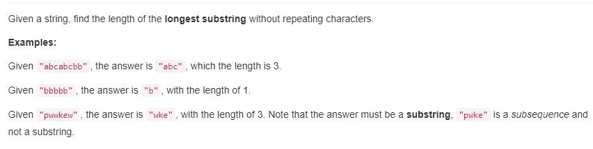
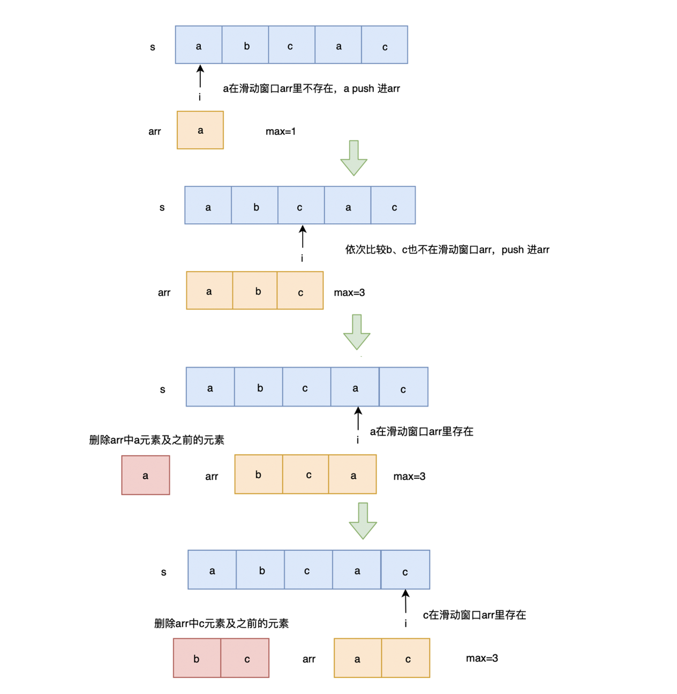

> 点击勘误[issues](https://github.com/webVueBlog/learn-web/issues)，哪吒感谢大家的阅读

[[toc]]

## 1. 题目描述（中等难度）



给定一个字符串，找到没有重复字符的最长子串，返回它的长度。

```js
给定一个字符串，请你找出其中不含有重复字符的 最长子串 的长度。

示例 1:

输入: "abcabcbb"
输出: 3
解释: 因为无重复字符的最长子串是 "abc"，所以其长度为 3。
示例 2:

输入: "bbbbb"
输出: 1
解释: 因为无重复字符的最长子串是 "b"，所以其长度为 1。
示例 3:

输入: "pwwkew"
输出: 3
解释: 因为无重复字符的最长子串是 "wke"，所以其长度为 3。
     请注意，你的答案必须是 子串 的长度，"pwke" 是一个子序列，不是子串。
```

对原数组进行判断，是否在arr里 如果在就将arr字符串之前的全部去除，不在就直接push，最后判断长度

```js
var lengthOfLongestSubstring = function(s) {
	let arr = [];
	let length = 0；
	for(let item of s) {
		if(arr.includes(item)) {
			let index = arr.indexOf(item);
			arr.splice(0, index+1);
		}
		arr.push(item);
		length = length > arr.length ? length : arr.length;
	}
	return length;
};
```

## 复杂度分析

- 时间复杂度：$O(N)$
- 空间复杂度：$O(N)$


```js
/**
 * @param {string} s
 * @return {number}
 */
var lengthOfLongestSubstring = function(s) {
    var str="" //存放无重复子串
    var size=0 //当前最长无重复子串的长度
    for(var i=0,len=s.length;i<len;i++){
        var char=s.charAt(i)
        var index=str.indexOf(char)
        if(index==-1){
            str+=char
            size=size<str.length?str.length:size
        }else{
            str=str.substr(index+1)+char
        }
    }
    return size
};
```

## 2. 解法

简单粗暴些，找一个最长子串，那么我们用两个循环穷举所有子串，然后再用一个函数判断该子串中有没有重复的字符。

时间复杂度：两个循环，加上判断子串满足不满足条件的函数中的循环，O（n³）。

## 解法：维护数组

解题思路： 使用一个数组来维护滑动窗口

遍历字符串，判断字符是否在滑动窗口数组里

- 不在则 push 进数组
- 在则删除滑动窗口数组里相同字符及相同字符前的字符，然后将当前字符 push 进数组
- 然后将 max 更新为当前最长子串的长度

遍历完，返回 max 即可



代码实现：

```js
var lengthOfLongestSubstring = function(s) {
    let arr = [], max = 0
    for(let i = 0; i < s.length; i++) {
        let index = arr.indexOf(s[i])
        if(index !== -1) {
            arr.splice(0, index+1);
        }
        arr.push(s.charAt(i))
        max = Math.max(arr.length, max) 
    }
    return max
};
```

## 维护下标

解题思路： 使用下标来维护滑动窗口

代码实现：

```js
var lengthOfLongestSubstring = function(s) {
    let index = 0, max = 0
    for(let i = 0, j = 0; j < s.length; j++) {
        index = s.substring(i, j).indexOf(s[j]) 
        if(index !== -1) { 
            i = i + index + 1 
        } 
        max = Math.max(max, j - i + 1) 
    }
    return max
};
```

## 优化的Map

解题思路：

使用 map 来存储当前已经遍历过的字符，key 为字符，value 为下标

使用 i 来标记无重复子串开始下标，j 为当前遍历字符下标

遍历字符串，判断当前字符是否已经在 map 中存在，存在则更新无重复子串开始下标 i 为相同字符的下一位置，此时从 i 到 j 为最新的无重复子串，更新 max ，将当前字符与下标放入 map 中

最后，返回 max 即可

代码实现：

```js
var lengthOfLongestSubstring = function(s) {
    let map = new Map(), max = 0
    for(let i = 0, j = 0; j < s.length; j++) {
        if(map.has(s[j])) {
            i = Math.max(map.get(s[j]) + 1, i)
        }
        max = Math.max(max, j - i + 1)
        map.set(s[j], j)
    }
    return max
};
```

时间复杂度：O(n)

空间复杂度：O(n)

