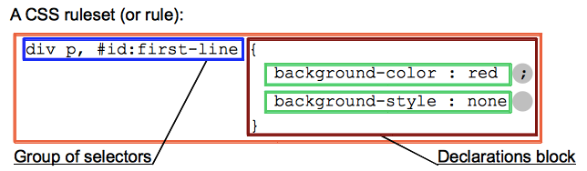

> 点击勘误[issues](https://github.com/webVueBlog/learn-web/issues)，哪吒感谢大家的阅读

[[toc]]

## 简介

选择器是 CSS 规则的一部分且位于 CSS 声明块前。



选择器可以被分为以下类别：

- 简单选择器（Simple selectors）：通过元素类型、class 或 id 匹配一个或多个元素。
- 属性选择器（Attribute selectors）：通过 属性 / 属性值 匹配一个或多个元素。
- 伪类（Pseudo-classes）：匹配处于确定状态的一个或多个元素，比如被鼠标指针悬停的元素，或当前被选中或未选中的复选框，或元素是 DOM 树中一父节点的第一个子节点。
- 伪元素（Pseudo-elements）:匹配处于相关的确定位置的一个或多个元素，例如每个段落的第一个字，或者某个元素之前生成的内容。
- 组合器（Combinators）：这里不仅仅是选择器本身，还有以有效的方式组合两个或更多的选择器用于非常特定的选择的方法。例如，你可以只选择 divs 的直系子节点的段落，或者直接跟在 headings 后面的段落。
- 多用选择器（Multiple selectors）：这些也不是单独的选择器；这个思路是将以逗号分隔开的多个选择器放在一个 CSS 规则下面， 以将一组声明应用于由这些选择器选择的所有元素。

## 简单选择器

### 类型选择器（又名：元素选择器）

此选择器只是一个选择器名和指定的HTML元素名的不区分大小写的匹配。这是选择所有指定类型的最简单方式。

### 类选择器（Class selectors）

类选择器由一个点“.”以及类后面的类名组成。类名是在HTML class文档元素属性中没有空格的任何值。由你自己选择一个名字。同样值得一提的是，文档中的多个元素可以具有相同的类名，而单个元素可以有多个类名(以空格分开多个类名的形式书写)。

### ID 选择器

ID选择器由哈希/磅符号 (#)组成，后面是给定元素的ID名称。 任何元素都可以使用id属性设置唯一的ID名称。 由你自己选择的ID是什么。 这是选择单个元素的最有效的方式。

:::tip
重要提示：一个ID名称必须在文件中是唯一的。关于重复ID的行为是不可预测的，比如在一些浏览器只是第一个实例计算，其余的将被忽略。
:::

### 通用选择器（Universal selector）

通用选择（`*`）是最终的王牌。它允许选择在一个页面中的所有元素。由于给每个元素应用同样的规则几乎没有什么实际价值，更常见的做法是与其他选择器结合使用。

:::tip
重要提示：使用通用选择时小心。因为它适用于所有的元素，在大型网页利用它可以对性能有明显的影响：网页可以显示比预期要慢。不会有太多的情况下，您想使用此选择。
:::

### 组合器（Combinators）

在CSS中，组合器允许您将多个选择器组合在一起，这允许您在其他元素中选择元素，或者与其他元素相邻。四种可用的类型是：

- 后代选择器——（空格键）——允许您选择嵌套在另一个元素中的某个元素（不一定是直接的后代;例如，它可以是一个孙子）。
- 子选择器—— > ——允许您选择一个元素，该元素是另一个元素的直接子元素。
- 相邻兄弟选择器—— + ——允许您选择一个元素，它是另一个元素的直接兄弟元素(也就是说，在它的旁边，在层次结构的同一层)。
- 通用兄弟选择器—— ~ — —允许您选择其他元素的兄弟元素(例如，在层次结构中的相同级别，但不一定就在它的旁边)。

```js
Combinators	Select
A,B	匹配满足A（和/或）B的任意元素.
A B	匹配任意元素，满足条件：B是A的后代结点（B是A的子节点，或者A的子节点的子节点）
A > B	匹配任意元素，满足条件：B是A的直接子节点
A + B	匹配任意元素，满足条件：B是A的下一个兄弟节点（AB有相同的父结点，并且B紧跟在A的后面）
A ~ B	匹配任意元素，满足条件：B是A之后的兄弟节点中的任意一个（AB有相同的父节点，B在A之后，但不一定是紧挨着A）
```

## 伪类和伪元素

### 伪类（Pseudo-class）

一个 CSS 伪类（pseudo-class） 是一个以冒号`(:)`作为前缀的关键字，当你希望样式在特定状态下才被呈现到指定的元素时，你可以往元素的选择器后面加上对应的伪类（pseudo-class）。你可能希望某个元素在处于某种状态下呈现另一种样式，例如当鼠标悬停在元素上面时，或者当一个 `checkbox` 被禁用或被勾选时，又或者当一个元素是它在 DOM 树中父元素的第一个孩子元素时。

```js
:active
:any
:checked
:default
:dir()
:disabled
:empty
:enabled
:first
:first-child
:first-of-type
:fullscreen
:focus
:hover
:indeterminate
:in-range
:invalid
:lang()
:last-child
:last-of-type
:left
:link
:not()
:nth-child()
:nth-last-child()
:nth-last-of-type()
:nth-of-type()
:only-child
:only-of-type
:optional
:out-of-range
:read-only
:read-write
:required
:right
:root
:scope
:target
:valid
:visited
```

### 伪元素

伪元素（`Pseudo-element`）跟伪类很像，但它们又有不同的地方。它们都是关键字 —— 但这次伪元素前缀是两个冒号 `(::)` —— 同样是添加到选择器后面达到指定某个元素的某个部分。

```js
::after
::before
::first-letter
::first-line
::selection
::backdrop
```

- [CSS选择器](https://segmentfault.com/a/1190000013424772)