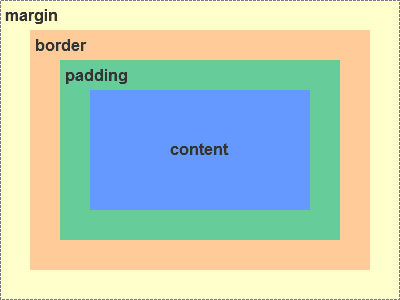
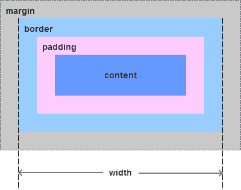
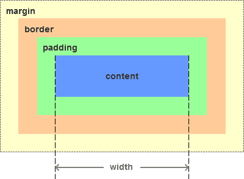
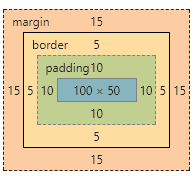
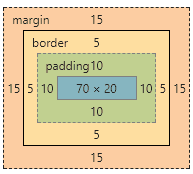
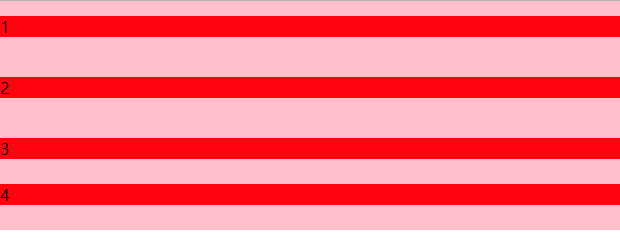

> 点击勘误[issues](https://github.com/webVueBlog/learn-web/issues)，哪吒感谢大家的阅读

## 盒模型的认识

1. 基本概念：标准模型+IE模型。包括 margin, border, padding, content
2. 标准模型和IE模型的区别
3. css如何设置获取这两种模型的宽和高
4. js如何设置获取盒模型对应的宽和高
5. 根据盒模型解释边距重叠
6. BFC(边距重叠解决方案，还有IFC) 解决边距重叠

## 一、基本概念：标准模型+IE模型

什么是盒模型：盒模型 又称 框模型（Box Model), 包含了 元素内容（content)、内边距（padding)、边距（border)、外边距（margin) 几个要素。如图：



由于IE盒模型的怪异模式，IE模型和标准模型的内容计算方式不同。

## 二、标准模型和IE模型的区别

IE模型和标准模型唯一的区别是内容计算方式的不同，如下图所示：



IE模型元素宽度width=content+padding+border，高度计算相同



标准模型元素宽度width=content，高度计算相同

## 三、css如何设置获取这两种模型的宽和高

通过css3新增的属性 `box-sizing: content-box` | `border-box`分别设置盒模型为标准模型（`content-box`）和IE模型（`border-box`）。

```js
.content-box {
  box-sizing:content-box;
  width: 100px;
  height: 50px;
  padding: 10px;
  border: 5px solid red;
  margin: 15px;
}
```



.content-box设置为标准模型，它的元素宽度width=100px。

```js
.border-box {
  box-sizing: border-box;
  width: 100px;
  height: 50px;
  padding: 10px;
  border: 5px solid red;
  margin: 15px;
}
```



.border-box设置为IE模型，它的元素宽度width=content + 2 padding + 2 border = 70px + 2 10px + 2 5px = 100px。

## 四、javascript如何设置获取盒模型对应的宽和高

1. `dom.style.width/height` 只能取到行内样式的宽和高，style标签中和link外链的样式取不到。
2. `dom.currentStyle.width/height` 取到的是最终渲染后的宽和高，只有IE支持此属性。
3. `window.getComputedStyle(dom).width/height` 同（2）但是多浏览器支持，IE9以上支持。
4. `dom.getBoundingClientRect().width/height` 也是得到渲染后的宽和高，大多浏览器支持。IE9以上支持，除此外还可以取到相对于视窗的上下左右的距离

## 五、外边距重叠

当两个垂直外边距相遇时，他们将形成一个外边距，合并后的外边距高度等于两个发生合并的外边距的高度中的较大者。注意：只有普通文档流中块框的垂直外边距才会发生外边距合并，行内框、浮动框或绝对定位之间的外边距不会合并。


这里父元素section的高度是多少呢，100px，但是我们给section设置overflow:hidden后高度就变成110px，这是为什么呢，其实这里我们给父元素创建了BFC。，什么是BFC,请看下面的介绍。

## 六 、BFC

BFC(Block Formatting Context)：块级格式化上下文。

BFC决定了元素如何对其内容进行定位，以及与其他元素的关系和相互作用。当设计到可视化布局的时候，BFC提供了一个环境，HTML元素在这个环境中按照一定的规则进行布局。一个环境中的元素不会影响到其他环境中的布局。

### BFC的原理（渲染规则）

1. BFC元素垂直方向的边距会发生重叠。属于不同BFC外边距不会发生重叠
2. BFC的区域不会与浮动元素的布局重叠。
3. BFC元素是一个独立的容器，外面的元素不会影响里面的元素。里面的元素也不会影响外面的元素。
4. 计算BFC高度的时候，浮动元素也会参与计算(清除浮动)

#### 如何创建BFC

1. overflow不为visible;
2. float的值不为none；
3. position的值不为static或relative；
4. display属性为inline-blocks,table,table-cell,table-caption,flex,inline-flex;

说了这么多规则，放几个实类出来看看。

```js
    <section id="margin">
        <style>
            * {
                padding: 0;
                margin: 0;
            }
            #margin {
                background: pink;
                overflow: hidden;
            }
            p {
                margin: 15px auto 25px;
                background: red;
            }
        </style>
        <p>1</p>
        <div style="overflow: hidden">
            <p>2</p>
        </div>
        <p>3</p>
        <p>4</p>
    </section>
```

请看这里的第二个p元素`<p>2</p>`他被一个父元素包裹，并且父元素有 overflow:hidden 样式，前面的如何创建BFC的第一条就说了 overflow:hidden 可以创建一个BFC。结果如下图所示。



我们看这里的2，它的上下外边距都没有与1和3发生重叠，但3与4外边距发生了重叠。这就解释了BFC创建了一个独立的环境，这个环境中的元素不会影响到其他环境中的布局，所以BFC内的外边距不与外部的外边距发生重叠。

再看看下面的列子：

```js
    <section id="layout">
        <style media="screen">
            #layout {
                background: red;
            }
            #layout .left {
                float: left;
                width: 100px;
                height: 100px;
                background: pink;
            }
            #layout .right {
                height: 110px;
                background: #ccc;
            }
        </style>
        <div class="left"></div>
        <div class="right"></div>
    </section>
```

效果如下：


写过前端页面的我们肯定遇到过这种情况，这里其实是浮动元素叠在 .right 元素的上面，如果我们想让.right元素不会延伸到 float元素怎么办,其实我们在.right元素上加 overflow:hidden （用其他的方式创建BFC也可以）创建BFC就可以解决。因为BFC不会与浮动元素发生重叠。


还有一种情况很常见，就是由于子元素浮动，导致父元素的高度不会把浮动元素算在内，那么我们在父元素创建BFC就可以让可以让浮动元素也参与高度计算。

IFC这里就不介绍，大家可以自行搜索。
