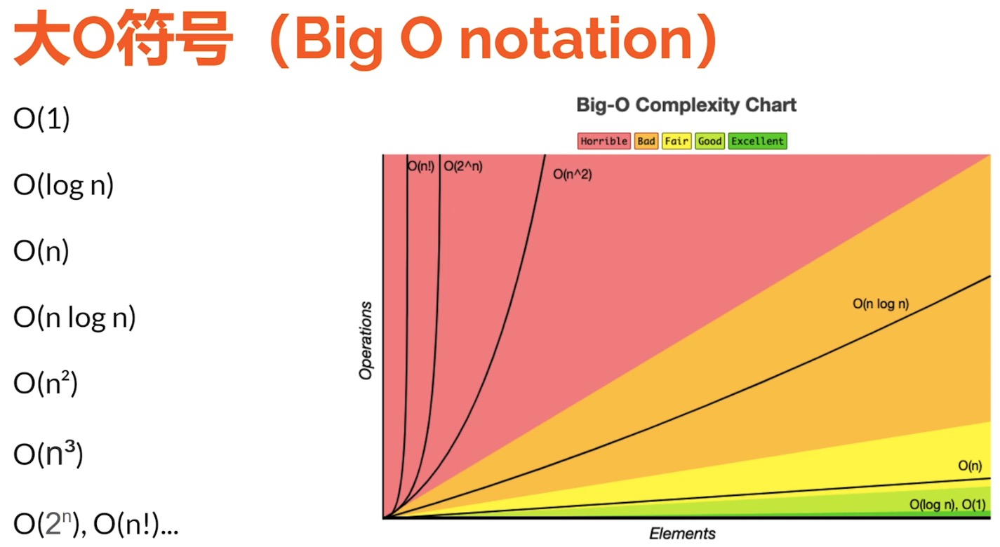

> 点击勘误[issues](https://github.com/webVueBlog/learn-web/issues)，哪吒感谢大家的阅读

[[toc]]



## 反转链表

```
var reverseList = function(head) {
 let prev = null;
 let curr = head;
 let next = null;
 while (curr != null) {
  next = curr.next;
  curr.next = prev;
  prev = curr;
  curr = next;
 }
 return prev;
}
```

## Set和Map

```js
const numberSet = new Set();
numberSet.add(1);
console.log(numberSet);
// Set(1) {1}
// Set里面的值是不重复的
numberSet.has(1) // true
numberSet.size()
// forEach
```

```js
const person = new Map()
person.set("name", "jeskson")
// for...of
```

## let和const

var 函数作用域， let const 块级作用域
