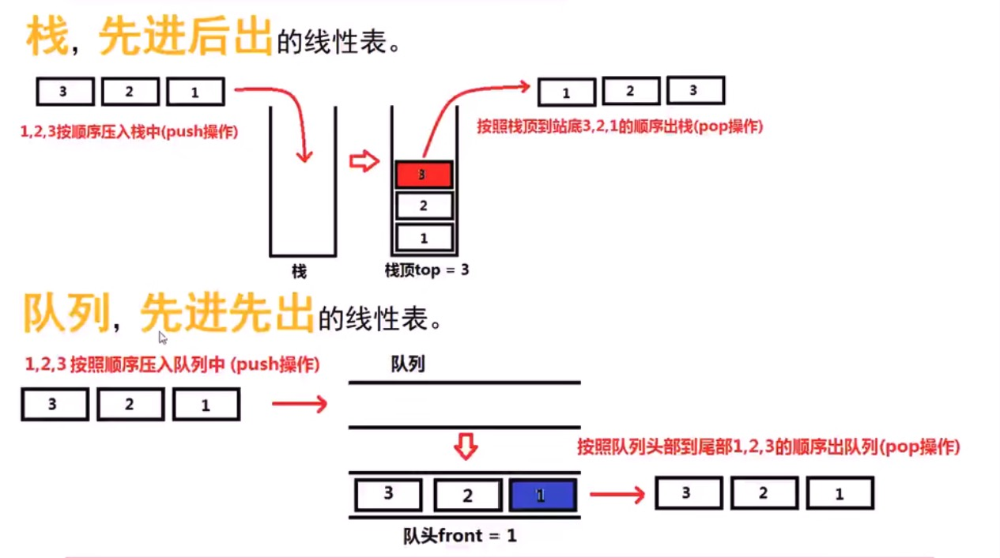
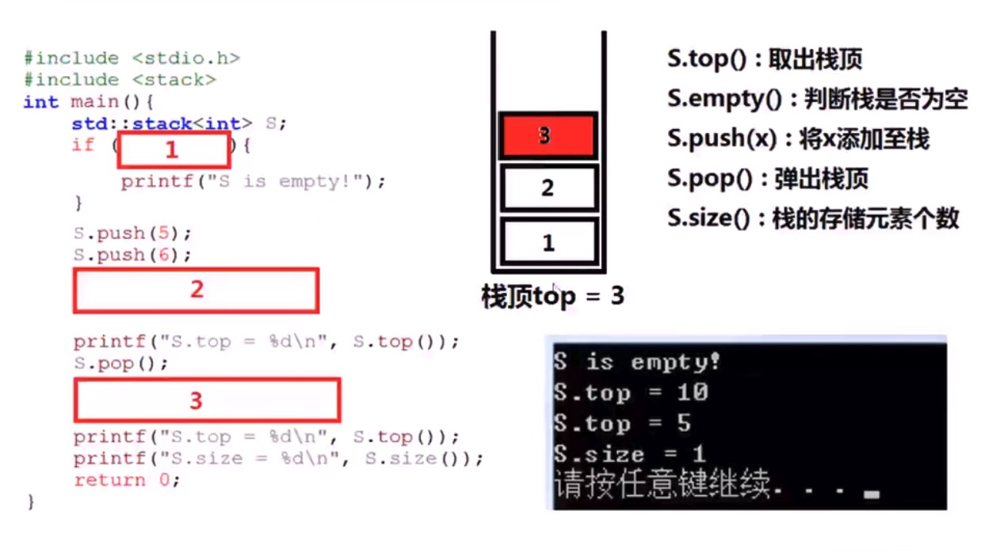
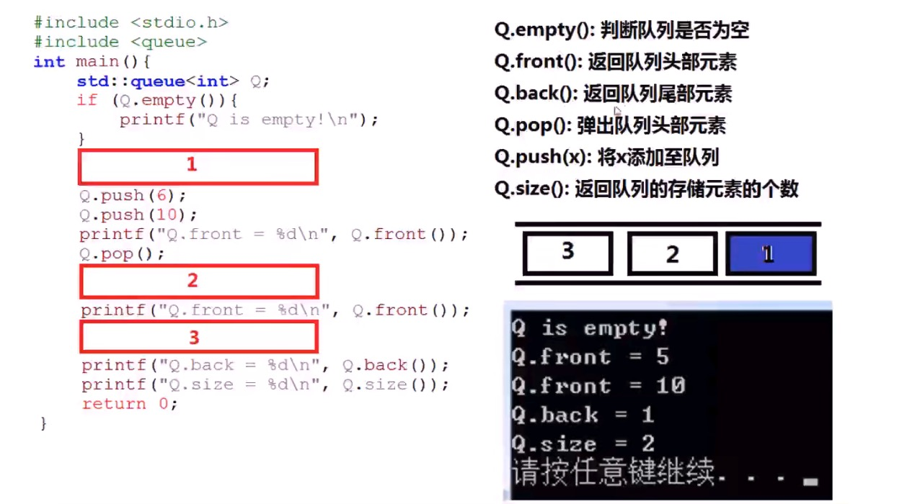
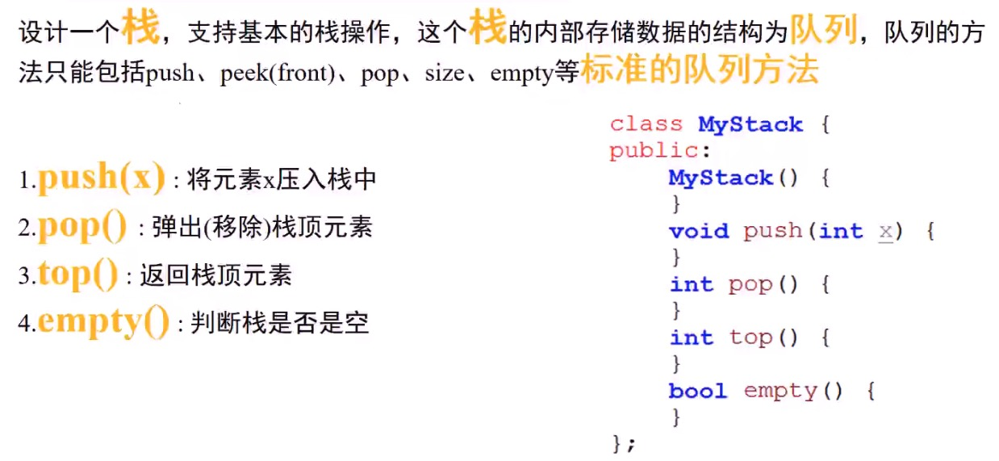

> 点击勘误[issues](https://github.com/webVueBlog/learn-web/issues)，哪吒感谢大家的阅读

[[toc]]

1. 使用队列实现栈 （栈，队列）
2. 使用栈实现队列 （栈，队列）
3. 包含min函数的栈
4. 合法的出栈序列
5. 简单的计算器
6. 寻找中位数

栈，先进后出的线性表。

- 1，2，3 按顺序压入栈中（push操作） 栈
- 按照栈顶栈低3，2，1的顺序出栈（pop操作）

队列，先进先出的线性表。

- 1，2，3按照顺序压入队列中（push操作）
- 按照队列头部到尾部1，2，3的顺序出队列（pop操作）



## 栈

```js
s.top(): 取出栈顶
s.empty(): 判断栈是否为空
s.push(x): 将x添加至栈
s.pop(): 弹出栈顶
s.size(): 栈的存储元素个数
```



```js
int main() {
 std::stack<int> S;
 if () {
  print()
 }
 S.push(5);
 ...
}
```

## 队列



```js
q.empty(): 判断队列是否为空
q.front(): 返回队列头部元素
q.back(): 返回队列尾部元素
q.pop(): 弹出队列头部元素
q.push(x): 将x添加至队列
q.size(): 返回队列的存储元素的个数
```

## 使用队列实现栈

设计一个栈，支持基本的栈操作，这个栈的内部存储数据的结构为队列，队列的方法只能包含push,peek(front),pop,size,empty等标准的队列方法

1. push(x): 将元素x压入栈中
2. pop(): 弹出（移除）栈顶元素
3. top(): 返回栈顶元素
4. empty(): 判断栈是否是空

```js
class MyStack {
 public:
  MyStack() {
  }
  void push(int x) {
  }
  int pop() {}
  int top() {}
  bool empty() {}
j}
```




