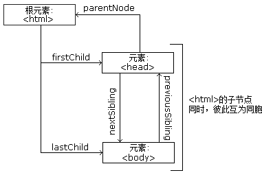

> 点击勘误[issues](https://github.com/webVueBlog/learn-web/issues)，哪吒感谢大家的阅读

## div

div标签用于组合其他HTML元素，本身无实在意义。常用于页面的布局，比如一个展开式的广告页面框架大致如下：

```html
<body>
    <div id="wrap-container">
        <div id="collapsed-container"></div>
        <div id="expanded-container"></div>
    </div>
</body>
```

## h1~h6, p, span, strong, em...

此类标签用于设置文本，常见的使用方式是填充段落，比如弹出的legal框文字HTML结构如下:

```html
<div id="legal-window">
    <h4>LEGAL</h4>
    
    <p>*Requires a system with Intel<sup>&reg;</sup> Turbo Boost Technology. Intel<sup>&reg;</sup> Turbo Boost Technology and Intel<sup>&reg;</sup> Turbo Boost Technology 2.0 are only available on select Intel<sup>&reg;</sup> processors. Consult your PC manufacturer. Performance varies depending on hardware, software, and system configuration. For more information, visit http://www.intel.com/go/turbo. Copyright &copy; 2014 Intel Corporation. All rights reserved. Intel, the Intel logo, Intel Core, Look Inside, Intel Inside, and Pentium are trademarks of Intel Corporation in the U.S. and/or other countries. Other names and brands may be claimed as the property of others.</p>
</div>
```

## ul, li, ol, dl, dt, dd

此类标签用于设置带有列表内容的，比如导航栏的下拉菜单，多视频的缩略图等：

```
<ul class="nav-tools-list">
    <li>
        <div>
            
            <span>Build & Price</span>
        </div>
    </li>
    <li>
        <div>
            
            <span>Incentives & Offers</span>
        </div>
    </li>
    <li>
        <div>
            
            <span>Request a Local Quote</span>
        </div>
    </li>
    <li>
        <div>
            
            <span>Search Dealer Inventory</span>
        </div>
    </li>
</ul>
```

## 基本 HTML

```js
Tag	Description
<!DOCTYPE> 	Defines the document type
<html>	Defines an HTML document
<head>	Contains metadata/information for the document
<title>	Defines a title for the document
<body>	Defines the document's body
<h1> to <h6>	Defines HTML headings
<p>	Defines a paragraph
<br>	Inserts a single line break
<hr>	Defines a thematic change in the content
<!--...-->	Defines a comment
```

## HTML语义化

语义化的含义就是用正确的标签做正确的事情，html语义化就是让页面的内容结构化，便于对浏览器、搜索引擎解析；在没有样式CCS情况下也以一种文档格式显示，并且是容易阅读的。搜索引擎的爬虫依赖于标记来确定上下文和各个关键字的权重，利于 SEO。使阅读源代码的人对网站更容易将网站分块，便于阅读维护理解。

## DOCTYPE和浏览器渲染模式

文档类型，一个文档类型标记是一种标准通用标记语言的文档类型声明，它的目的是要告诉标准通用标记语言解析器，它应该使用什么样的文档类型定义（DTD）来解析文档。Doctype还会对浏览器的渲染模式产生影响，不同的渲染模式会影响到浏览器对于 CSS 代码甚至 JavaScript 脚本的解析，所以Doctype是非常关键的，尤其是在 IE 系列浏览器中，由DOCTYPE 所决定的 HTML 页面的渲染模式至关重要。

## 浏览器解析HTML方式

有三种解析方式:

- 非怪异（标准）模式
- 怪异模式
- 部分怪异（近乎标准）模式

在“标准模式”`(standards mode) `页面按照 `HTML` 与 `CSS` 的定义渲染，而在“怪异模式(`quirks mode`) 模式”中则尝试模拟更旧的浏览器的行为。 一些浏览器（例如，那些基于 `Mozilla` 的 `Gecko` 渲染引擎的，或者 `Internet Explorer 8` 在 `strict mode` 下）也使用一种尝试于这两者之间妥协的“近乎标准”(`almost standards`) 模式，实施了一种表单元格尺寸的怪异行为，除此之外符合标准定义。

一个不含任何 `DOCTYPE` 的网页将会以 怪异(`quirks`) 模式渲染。

`HTML5`提供的`<DOCTYPE html>`是标准模式，向后兼容的, 等同于开启了标准模式，那么浏览器就得老老实实的按照W3C的 标准解析渲染页面，这样一来，你的页面在所有的浏览器里显示的就都是一个样子了。

## 理解DOM结构

DOM: Document Object Module, 文档对象模型。我们通过JavaScript操作页面的元素，进行添加、移动、改变或移除的方法和属性, 都是DOM提供的。

## W3C DOM 标准

被分为 3 个不同的部分:

- 核心 DOM - 针对任何结构化文档的标准模型
- XML DOM - 针对 XML 文档的标准模型
- HTML DOM - 针对 HTML 文档的标准模型

## DOM节点

根据 W3C 的 HTML DOM 标准，HTML 文档中的所有内容都是节点：

- 整个文档是一个文档节点
- 每个 HTML 元素是元素节点
- HTML 元素内的文本是文本节点
- 每个 HTML 属性是属性节点
- 注释是注释节点

## HTML DOM 节点树

HTML文本会被解析为DOM树, 树中的所有节点均可通过 JavaScript 进行访问。所有 HTML 元素（节点）均可被修改，也可以创建或删除节点。

## 节点的关系

父（parent）、子（child）和同胞（sibling）等术语用于描述这些关系。父节点拥有子节点。同级的子节点被称为同胞（兄弟或姐妹）:

- 在节点树中，顶端节点被称为根（root）
- 每个节点都有父节点、除了根（它没有父节点）
- 一个节点可拥有任意数量的子节点
- 同胞是拥有相同父节点的节点



## HTML5新增内容

HTML5 是对 HTML 标准的第五次修订。其主要的目标是将互联网语义化，以便更好地被人类和机器阅读，并同时提供更好地支持各种媒体的嵌入。HTML5 的语法是向后兼容的。现在国内普遍说的 H5 是包括了 CSS3，JavaScript 的说法（严格意义上说，这么叫并不合适，但是已经这么叫开了，就将错就错了）。

## 与HTML 4的不同之处

- 文件类型声明`（<!DOCTYPE>）`仅有一型：`<!DOCTYPE HTML>`。
- 新的解析顺序：不再基于SGML。
- 新的元素：section, video, progress, nav, meter, time, aside, canvas, command, datalist, details, embed, figcaption, figure, footer, header, hgroup, keygen, mark, output, rp, rt, ruby, source, summary, wbr。
- input元素的新类型：date, email, url等等。
- 新的属性：ping（用于a与area）, charset（用于meta）, async（用于script）。
- 全域属性：id, tabindex, repeat。
- 新的全域属性：contenteditable, contextmenu, draggable, dropzone, hidden, spellcheck。
- 移除元素：acronym, applet, basefont, big, center, dir, font, frame, frameset, isindex, noframes, strike, tt。

## 新增标签

HTML 5提供了一些新的元素和属性，反映典型的现代用法网站。其中有些是技术上类似`<div>`和`<span>`标签，但有一定含义，例如`<nav>`（网站导航块）和`<footer> <audio>`和`<video>`标记。

## 移除的标签

一些过时的HTML 4标记将取消，其中包括纯粹用作显示效果的标记，如`<font>`和`<center>`，因为它们已经被CSS取代。还有一些通过DOM的网络行为。

## 修改的标签

尽管和SGML在标记上的相似性，HTML5的句法并不再基于它了，而是被设计成向后兼容对老版本的HTML的解析。它有一个新的开始列看起来就像SGML的文档类型声明，`<!DOCTYPE HTML>`，这会触发和标准兼容的渲染模式。在2009年1月5号，HTML5添加了Web Form 2.0的内容，html5开始发展起来。
