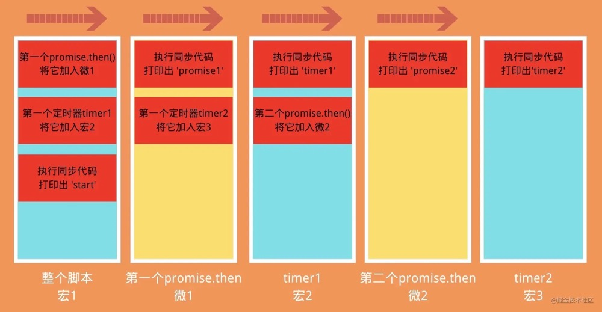

> 点击勘误[issues](https://github.com/webVueBlog/learn-web/issues)，哪吒感谢大家的阅读

[[toc]]

## 前期准备

event loop它的执行顺序：

- 一开始整个脚本作为一个宏任务执行
- 执行过程中同步代码直接执行，宏任务进入宏任务队列，微任务进入微任务队列
- 当前宏任务执行完出队，检查微任务列表，有则依次执行，直到全部执行完
- 执行浏览器UI线程的渲染工作
- 检查是否有Web Worker任务，有则执行
- 执行完本轮的宏任务，回到2，依此循环，直到宏任务和微任务队列都为空

微任务包括：MutationObserver、Promise.then()或catch()、Promise为基础开发的其它技术，比如fetch API、V8的垃圾回收过程、Node独有的process.nextTick。

宏任务包括：script 、setTimeout、setInterval 、setImmediate 、I/O 、UI rendering。

注意⚠️：在所有任务开始的时候，由于宏任务中包括了script，所以浏览器会先执行一个宏任务，在这个过程中你看到的延迟任务(例如setTimeout)将被放到下一轮宏任务中来执行。

## 1.1 题目一

```js
const promise1 = new Promise((resolve, reject) => {
  console.log('promise1')
})
console.log('1', promise1);
```

过程分析：

- 从上至下，先遇到new Promise，执行该构造函数中的代码promise1
- 然后执行同步代码1，此时promise1没有被resolve或者reject，因此状态还是pending

结果：

```js
'promise1'
'1' Promise{<pending>}
```

## 1.2 题目二

```js
const promise = new Promise((resolve, reject) => {
  console.log(1);
  resolve('success')
  console.log(2);
});
promise.then(() => {
  console.log(3);
});
console.log(4);
```

过程分析：

- 从上至下，先遇到new Promise，执行其中的同步代码1
- 再遇到resolve('success')， 将promise的状态改为了resolved并且将值保存下来
- 继续执行同步代码2
- 跳出promise，往下执行，碰到promise.then这个微任务，将其加入微任务队列
- 执行同步代码4
- 本轮宏任务全部执行完毕，检查微任务队列，发现promise.then这个微任务且状态为resolved，执行它。

结果：

```js
1 2 4 3
```

## 1.3 题目三

```js
const promise = new Promise((resolve, reject) => {
  console.log(1);
  console.log(2);
});
promise.then(() => {
  console.log(3);
});
console.log(4);
```

代码过程分析

- 和题目二相似，只不过在promise中并没有resolve或者reject
- 因此promise.then并不会执行，它只有在被改变了状态之后才会执行。

结果：

```js
1 2 4
```

## 1.4 题目四

```js
const promise1 = new Promise((resolve, reject) => {
  console.log('promise1')
  resolve('resolve1')
})
const promise2 = promise1.then(res => {
  console.log(res)
})
console.log('1', promise1);
console.log('2', promise2);
```

代码过程分析：

- 从上至下，先遇到new Promise，执行该构造函数中的代码promise1
- 碰到resolve函数, 将promise1的状态改变为resolved, 并将结果保存下来
- 碰到promise1.then这个微任务，将它放入微任务队列
- promise2是一个新的状态为pending的Promise
- 执行同步代码1， 同时打印出promise1的状态是resolved
- 执行同步代码2，同时打印出promise2的状态是pending
- 宏任务执行完毕，查找微任务队列，发现promise1.then这个微任务且状态为resolved，执行它。

结果：

```js
'promise1'
'1' Promise{<resolved>: 'resolve1'}
'2' Promise{<pending>}
'resolve1'
```

## 1.5 题目五

接下来看看这道题：

```js
const fn = () => (new Promise((resolve, reject) => {
  console.log(1);
  resolve('success')
}))
fn().then(res => {
  console.log(res)
})
console.log('start')
```

代码这道题里最先执行的是'start'吗 🤔️ ？

请仔细看看哦，fn函数它是直接返回了一个new Promise的，而且fn函数的调用是在start之前，所以它里面的内容应该会先执行。

结果：

```js
1
'start'
'success'
```

## 1.6 题目六

如果把fn的调用放到start之后呢？

```js
const fn = () =>
  new Promise((resolve, reject) => {
    console.log(1);
    resolve("success");
  });
console.log("start");
fn().then(res => {
  console.log(res);
});
```

代码是的，现在start就在1之前打印出来了，因为fn函数是之后执行的。

注意⚠️：之前我们很容易就以为看到new Promise()就执行它的第一个参数函数了，其实这是不对的，就像这两道题中，我们得注意它是不是被包裹在函数当中，如果是的话，只有在函数调用的时候才会执行。

答案：

```js
"start"
1
"success"
```

## 2. Promise结合setTimeout

## 2.1 题目一

```js
console.log('start')
setTimeout(() => {
  console.log('time')
})
Promise.resolve().then(() => {
  console.log('resolve')
})
console.log('end')
```

代码过程分析：

- 刚开始整个脚本作为一个宏任务来执行，对于同步代码直接压入执行栈进行执行，因此先打印出start和end。
- setTimout作为一个宏任务被放入宏任务队列(下一个)
- Promise.then作为一个微任务被放入微任务队列
- 本次宏任务执行完，检查微任务，发现Promise.then，执行它
- 接下来进入下一个宏任务，发现setTimeout，执行。

结果：

```js
'start'
'end'
'resolve'
'time'
```

## 2.2 题目二

```js
const promise = new Promise((resolve, reject) => {
  console.log(1);
  setTimeout(() => {
    console.log("timerStart");
    resolve("success");
    console.log("timerEnd");
  }, 0);
  console.log(2);
});
promise.then((res) => {
  console.log(res);
});
console.log(4);
```

代码过程分析：

和题目1.2很像，不过在resolve的外层加了一层setTimeout定时器。

- 从上至下，先遇到new Promise，执行该构造函数中的代码1
- 然后碰到了定时器，将这个定时器中的函数放到下一个宏任务的延迟队列中等待执行
- 执行同步代码2
- 跳出promise函数，遇到promise.then，但其状态还是为pending，这里理解为先不执行
- 执行同步代码4
- 一轮循环过后，进入第二次宏任务，发现延迟队列中有setTimeout定时器，执行它
- 首先执行timerStart，然后遇到了resolve，将promise的状态改为resolved且保存结果并将之前的promise.then推入微任务队列
- 继续执行同步代码timerEnd
- 宏任务全部执行完毕，查找微任务队列，发现promise.then这个微任务，执行它。

因此执行结果为：

```js
1
2
4
"timerStart"
"timerEnd"
"success"
```

## 2.3 题目三

题目三分了两个题目，因为看着都差不多，不过执行的结果却不一样，大家不妨先猜猜下面两个题目分别执行什么：

(1):

```js
setTimeout(() => {
  console.log('timer1');
  setTimeout(() => {
    console.log('timer3')
  }, 0)
}, 0)
setTimeout(() => {
  console.log('timer2')
}, 0)
console.log('start')
```

(2):

```js
setTimeout(() => {
  console.log('timer1');
  Promise.resolve().then(() => {
    console.log('promise')
  })
}, 0)
setTimeout(() => {
  console.log('timer2')
}, 0)
console.log('start')
```

执行结果：

```js
'start'
'timer1'
'timer2'
'timer3'
```

```js
'start'
'timer1'
'promise'
'timer2'
```

这两个例子，看着好像只是把第一个定时器中的内容换了一下而已。

一个是为定时器timer3，一个是为Promise.then

但是如果是定时器timer3的话，它会在timer2后执行，而Promise.then却是在timer2之前执行。

你可以这样理解，Promise.then是微任务，它会被加入到本轮中的微任务列表，而定时器timer3是宏任务，它会被加入到下一轮的宏任务中。

## 2.3 题目三

```js
Promise.resolve().then(() => {
  console.log('promise1');
  const timer2 = setTimeout(() => {
    console.log('timer2')
  }, 0)
});
const timer1 = setTimeout(() => {
  console.log('timer1')
  Promise.resolve().then(() => {
    console.log('promise2')
  })
}, 0)
console.log('start');
```

这道题稍微的难一些，在promise中执行定时器，又在定时器中执行promise；

并且要注意的是，这里的Promise是直接resolve的，而之前的new Promise不一样。

(偷偷告诉你，这道题往下一点有流程图)

因此过程分析为：

- 刚开始整个脚本作为第一次宏任务来执行，我们将它标记为宏1，从上至下执行
- 遇到Promise.resolve().then这个微任务，将then中的内容加入第一次的微任务队列标记为微1
- 遇到定时器timer1，将它加入下一次宏任务的延迟列表，标记为宏2，等待执行(先不管里面是什么内容)
- 执行宏1中的同步代码start
- 第一次宏任务(宏1)执行完毕，检查第一次的微任务队列(微1)，发现有一个promise.then这个微任务需要执行
- 执行打印出微1中同步代码promise1，然后发现定时器timer2，将它加入宏2的后面，标记为宏3
- 第一次微任务队列(微1)执行完毕，执行第二次宏任务(宏2)，首先执行同步代码timer1
- 然后遇到了promise2这个微任务，将它加入此次循环的微任务队列，标记为微2
- 宏2中没有同步代码可执行了，查找本次循环的微任务队列(微2)，发现了promise2，执行它
- 第二轮执行完毕，执行宏3，打印出timer2

所以结果为：

```js
'start'
'promise1'
'timer1'
'promise2'
'timer2'
```

如果感觉有点绕的话，可以看下面这张图，就一目了然了。



## 2.4 题目四

```js
const promise1 = new Promise((resolve, reject) => {
  setTimeout(() => {
    resolve('success')
  }, 1000)
})
const promise2 = promise1.then(() => {
  throw new Error('error!!!')
})
console.log('promise1', promise1)
console.log('promise2', promise2)
setTimeout(() => {
  console.log('promise1', promise1)
  console.log('promise2', promise2)
}, 2000)
```

过程分析：

- 从上至下，先执行第一个new Promise中的函数，碰到setTimeout将它加入下一个宏任务列表
- 跳出new Promise，碰到promise1.then这个微任务，但其状态还是为pending，这里理解为先不执行
- promise2是一个新的状态为pending的Promise
- 执行同步代码console.log('promise1')，且打印出的promise1的状态为pending
- 执行同步代码console.log('promise2')，且打印出的promise2的状态为pending
- 碰到第二个定时器，将其放入下一个宏任务列表
- 第一轮宏任务执行结束，并且没有微任务需要执行，因此执行第二轮宏任务
- 先执行第一个定时器里的内容，将promise1的状态改为resolved且保存结果并将之前的promise1.then推入微任务队列
- 该定时器中没有其它的同步代码可执行，因此执行本轮的微任务队列，也就是promise1.then，它抛出了一个错误，且将promise2的状态设置为了rejected
- 第一个定时器执行完毕，开始执行第二个定时器中的内容
- 打印出'promise1'，且此时promise1的状态为resolved
- 打印出'promise2'，且此时promise2的状态为rejected

完整的结果为：

```js
'promise1' Promise{<pending>}
'promise2' Promise{<pending>}
test5.html:102 Uncaught (in promise) Error: error!!! at test.html:102
'promise1' Promise{<resolved>: "success"}
'promise2' Promise{<rejected>: Error: error!!!}
```

## 2.5 题目五

如果你上面这道题搞懂了之后，我们就可以来做做这道了，你应该能很快就给出答案：

```js
const promise1 = new Promise((resolve, reject) => {
  setTimeout(() => {
    resolve("success");
    console.log("timer1");
  }, 1000);
  console.log("promise1里的内容");
});
const promise2 = promise1.then(() => {
  throw new Error("error!!!");
});
console.log("promise1", promise1);
console.log("promise2", promise2);
setTimeout(() => {
  console.log("timer2");
  console.log("promise1", promise1);
  console.log("promise2", promise2);
}, 2000);
```

结果：

```js
'promise1里的内容'
'promise1' Promise{<pending>}
'promise2' Promise{<pending>}
'timer1'
test5.html:102 Uncaught (in promise) Error: error!!! at test.html:102
'timer2'
'promise1' Promise{<resolved>: "success"}
'promise2' Promise{<rejected>: Error: error!!!}
```

## 3. Promise中的then、catch、finally

总结：

- Promise的状态一经改变就不能再改变。(见3.1)
- .then和.catch都会返回一个新的Promise。(上面的👆1.4证明了)
- catch不管被连接到哪里，都能捕获上层未捕捉过的错误。(见3.2)
- 在Promise中，返回任意一个非 promise 的值都会被包裹成 promise 对象，例如return 2会被包装为return Promise.resolve(2)。
- Promise 的 .then 或者 .catch 可以被调用多次, 但如果Promise内部的状态一经改变，并且有了一个值，那么后续每次调用.then或者.catch的时候都会直接拿到该值。(见3.5)
- .then 或者 .catch 中 return 一个 error 对象并不会抛出错误，所以不会被后续的 .catch 捕获。(见3.6)
- .then 或 .catch 返回的值不能是 promise 本身，否则会造成死循环。(见3.7)
- .then 或者 .catch 的参数期望是函数，传入非函数则会发生值透传。(见3.8)
- .then方法是能接收两个参数的，第一个是处理成功的函数，第二个是处理失败的函数，再某些时候你可以认为catch是.then第二个参数的简便写法。(见3.9)
- .finally方法也是返回一个Promise，他在Promise结束的时候，无论结果为resolved还是rejected，都会执行里面的回调函数。

## 3.1 题目一

```js
const promise = new Promise((resolve, reject) => {
  resolve("success1");
  reject("error");
  resolve("success2");
});
promise
.then(res => {
    console.log("then: ", res);
  }).catch(err => {
    console.log("catch: ", err);
  })
```

结果：

```js
"then: success1"
```

构造函数中的 resolve 或 reject 只有第一次执行有效，多次调用没有任何作用 。验证了第一个结论，Promise的状态一经改变就不能再改变。

## 3.2 题目二

```js
const promise = new Promise((resolve, reject) => {
  reject("error");
  resolve("success2");
});
promise
.then(res => {
    console.log("then1: ", res);
  }).then(res => {
    console.log("then2: ", res);
  }).catch(err => {
    console.log("catch: ", err);
  }).then(res => {
    console.log("then3: ", res);
  })
```

结果：

```js
"catch: " "error"
"then3: " undefined
```

验证了第三个结论，catch不管被连接到哪里，都能捕获上层未捕捉过的错误。

至于then3也会被执行，那是因为catch()也会返回一个Promise，且由于这个Promise没有返回值，所以打印出来的是undefined。

## 3.3 题目三

```js
Promise.resolve(1)
  .then(res => {
    console.log(res);
    return 2;
  })
  .catch(err => {
    return 3;
  })
  .then(res => {
    console.log(res);
  });
```

结果：

```js
1
2
```

Promise可以链式调用，不过promise 每次调用 .then 或者 .catch 都会返回一个新的 promise，从而实现了链式调用, 它并不像一般我们任务的链式调用一样return this。

上面的输出结果之所以依次打印出1和2，那是因为resolve(1)之后走的是第一个then方法，并没有走catch里，所以第二个then中的res得到的实际上是第一个then的返回值。

且return 2会被包装成resolve(2)。

## 3.4 题目四

如果把3.3中的Promise.resolve(1)改为Promise.reject(1)又会怎么样呢？

```js
Promise.reject(1)
  .then(res => {
    console.log(res);
    return 2;
  })
  .catch(err => {
    console.log(err);
    return 3
  })
  .then(res => {
    console.log(res);
  });
```

结果：

```js
1
3
```

结果打印的当然是 1 和 3啦，因为reject(1)此时走的就是catch，且第二个then中的res得到的就是catch中的返回值。

## 3.5 题目五

```js
const promise = new Promise((resolve, reject) => {
  setTimeout(() => {
    console.log('timer')
    resolve('success')
  }, 1000)
})
const start = Date.now();
promise.then(res => {
  console.log(res, Date.now() - start)
})
promise.then(res => {
  console.log(res, Date.now() - start)
})
```

执行结果：

```js
'timer'
'success' 1001
'success' 1002
```

当然，如果你足够快的话，也可能两个都是1001。

Promise 的 .then 或者 .catch 可以被调用多次，但这里 Promise 构造函数只执行一次。或者说 promise 内部状态一经改变，并且有了一个值，那么后续每次调用 .then 或者 .catch 都会直接拿到该值。

## 3.6 题目六

```js
Promise.resolve().then(() => {
  return new Error('error!!!')
}).then(res => {
  console.log("then: ", res)
}).catch(err => {
  console.log("catch: ", err)
})
```

猜猜这里的结果输出的是什么 🤔️ ？

你可能想到的是进入.catch然后被捕获了错误。

结果并不是这样的，它走的是.then里面：

```js
"then: " "Error: error!!!"
```

这也验证了第4点和第6点，返回任意一个非 promise 的值都会被包裹成 promise 对象，因此这里的return new Error('error!!!')也被包裹成了return Promise.resolve(new Error('error!!!'))。

当然如果你抛出一个错误的话，可以用下面👇两的任意一种：

```js
return Promise.reject(new Error('error!!!'));
// or
throw new Error('error!!!')
```

## 3.7 题目七

```js
const promise = Promise.resolve().then(() => {
  return promise;
})
promise.catch(console.err)
```

.then 或 .catch 返回的值不能是 promise 本身，否则会造成死循环。

因此结果会报错：

```js
Uncaught (in promise) TypeError: Chaining cycle detected for promise #<Promise>
```

## 3.8 题目八

```js
Promise.resolve(1)
  .then(2)
  .then(Promise.resolve(3))
  .then(console.log)
```

其实你只要记住原则8：.then 或者 .catch 的参数期望是函数，传入非函数则会发生值透传。

第一个then和第二个then中传入的都不是函数，一个是数字类型，一个是对象类型，因此发生了透传，将resolve(1) 的值直接传到最后一个then里。

所以输出结果为：

```js
1
```

## 3.9 题目九

下面来介绍一下.then函数中的两个参数。

第一个参数是用来处理Promise成功的函数，第二个则是处理失败的函数。

也就是说Promise.resolve('1')的值会进入成功的函数，Promise.reject('2')的值会进入失败的函数。

让我们来看看这个例子🌰：

```js
Promise.reject('err!!!')
  .then((res) => {
    console.log('success', res)
  }, (err) => {
    console.log('error', err)
  }).catch(err => {
    console.log('catch', err)
  })
```

这里的执行结果是：

```js
'error' 'error!!!'
```

它进入的是then()中的第二个参数里面，而如果把第二个参数去掉，就进入了catch()中：

```js
Promise.reject('error!!!')
  .then((res) => {
    console.log('success', res)
  }).catch(err => {
    console.log('catch', err)
  })
```

执行结果：

```js
'catch' 'error!!!'
```

但是有一个问题，如果是这个案例呢？

```js
Promise.resolve()
  .then(function success (res) {
    throw new Error('error!!!')
  }, function fail1 (err) {
    console.log('fail1', err)
  }).catch(function fail2 (err) {
    console.log('fail2', err)
  })
```

由于Promise调用的是resolve()，因此.then()执行的应该是success()函数，可是success()函数抛出的是一个错误，它会被后面的catch()给捕获到，而不是被fail1函数捕获。

因此执行结果为：

```js
fail2 Error: error!!!
			at success
```

## 3.10 题目十

接着来看看.finally()，这个功能一般不太用在面试中，不过如果碰到了你也应该知道该如何处理。

其实你只要记住它三个很重要的知识点就可以了：

1. .finally()方法不管Promise对象最后的状态如何都会执行
2. .finally()方法的回调函数不接受任何的参数，也就是说你在.finally()函数中是没法知道Promise最终的状态是resolved还是rejected的
3. 它最终返回的默认会是一个上一次的Promise对象值，不过如果抛出的是一个异常则返回异常的Promise对象。

来看看这个简单的例子🌰：

```js
Promise.resolve('1')
  .then(res => {
    console.log(res)
  })
  .finally(() => {
    console.log('finally')
  })
Promise.resolve('2')
  .finally(() => {
    console.log('finally2')
  	return '我是finally2返回的值'
  })
  .then(res => {
    console.log('finally2后面的then函数', res)
  })
```

这两个Promise的.finally都会执行，且就算finally2返回了新的值，它后面的then()函数接收到的结果却还是'2'，因此打印结果为：

```js
'1'
'finally2'
'finally'
'finally2后面的then函数' '2'
```

至于为什么finally2的打印要在finally前面，请看下一个例子中的解析。

不过在此之前让我们再来确认一下，finally中要是抛出的是一个异常是怎样的：

```js
Promise.resolve('1')
  .finally(() => {
    console.log('finally1')
    throw new Error('我是finally中抛出的异常')
  })
  .then(res => {
    console.log('finally后面的then函数', res)
  })
  .catch(err => {
    console.log('捕获错误', err)
  })
```

执行结果为：

```js
'finally1'
'捕获错误' Error: 我是finally中抛出的异常
```

但是如果改为return new Error('我是finally中抛出的异常')，打印出来的就是'finally后面的then函数 1'

OK，👌，让我们来看一个比较难的例子🌰：

```js
function promise1 () {
  let p = new Promise((resolve) => {
    console.log('promise1');
    resolve('1')
  })
  return p;
}
function promise2 () {
  return new Promise((resolve, reject) => {
    reject('error')
  })
}
promise1()
  .then(res => console.log(res))
  .catch(err => console.log(err))
  .finally(() => console.log('finally1'))

promise2()
  .then(res => console.log(res))
  .catch(err => console.log(err))
  .finally(() => console.log('finally2'))
```

执行过程：

- 首先定义了两个函数promise1和promise2，先不管接着往下看。
- promise1函数先被调用了，然后执行里面new Promise的同步代码打印出promise1
- 之后遇到了resolve(1)，将p的状态改为了resolved并将结果保存下来。
- 此时promise1内的函数内容已经执行完了，跳出该函数
- 碰到了promise1().then()，由于promise1的状态已经发生了改变且为resolved因此将promise1().then()这条微任务加入本轮的微任务列表(这是第一个微任务)
- 这时候要注意了，代码并不会接着往链式调用的下面走，也就是不会先将.finally加入微任务列表，那是因为.then本身就是一个微任务，它链式后面的内容必须得等当前这个微任务执行完才会执行，因此这里我们先不管.finally()
- 再往下走碰到了promise2()函数，其中返回的new Promise中并没有同步代码需要执行，所以执行reject('error')的时候将promise2函数中的Promise的状态变为了rejected
- 跳出promise2函数，遇到了promise2().catch()，将其加入当前的微任务队列(这是第二个微任务)，且链式调用后面的内容得等该任务执行完后才执行，和.then()一样。
- OK， 本轮的宏任务全部执行完了，来看看微任务列表，存在promise1().then()，执行它，打印出1，然后遇到了.finally()这个微任务将它加入微任务列表(这是第三个微任务)等待执行
- 再执行promise2().catch()打印出error，执行完后将finally2加入微任务加入微任务列表(这是第四个微任务)
- OK， 本轮又全部执行完了，但是微任务列表还有两个新的微任务没有执行完，因此依次执行finally1和finally2。

结果：

```js
'promise1'
'1'
'error'
'finally1'
'finally2'
```

在这道题中其实能拓展的东西挺多的，之前没有提到，那就是你可以理解为链式调用后面的内容需要等前一个调用执行完才会执行。

就像是这里的finally()会等promise1().then()执行完才会将finally()加入微任务队列，其实如果这道题中你把finally()换成是then()也是这样的:

```js
function promise1 () {
  let p = new Promise((resolve) => {
    console.log('promise1');
    resolve('1')
  })
  return p;
}
function promise2 () {
  return new Promise((resolve, reject) => {
    reject('error')
  })
}
promise1()
  .then(res => console.log(res))
  .catch(err => console.log(err))
  .then(() => console.log('finally1'))

promise2()
  .then(res => console.log(res))
  .catch(err => console.log(err))
  .then(() => console.log('finally2'))
```

## 4. Promise中的all和race

在做下面👇的题目之前，让我们先来了解一下Promise.all()和Promise.race()的用法。

通俗来说，.all()的作用是接收一组异步任务，然后并行执行异步任务，并且在所有异步操作执行完后才执行回调。

.race()的作用也是接收一组异步任务，然后并行执行异步任务，只保留取第一个执行完成的异步操作的结果，其他的方法仍在执行，不过执行结果会被抛弃。

来看看题目一。

## 4.1 题目一

我们知道如果直接在脚本文件中定义一个Promise，它构造函数的第一个参数是会立即执行的，就像这样：

```js
const p1 = new Promise(r => console.log('立即打印'))
```

复制代码控制台中会立即打印出 “立即打印”。

因此为了控制它什么时候执行，我们可以用一个函数包裹着它，在需要它执行的时候，调用这个函数就可以了：

```js
function runP1 () {
    const p1 = new Promise(r => console.log('立即打印'))
    return p1
}

runP1() // 调用此函数时才执行
```

OK 👌， 让我们回归正题。

现在来构建这么一个函数：

```js
function runAsync (x) {
    const p = new Promise(r => setTimeout(() => r(x, console.log(x)), 1000))
    return p
}
```

该函数传入一个值x，然后间隔一秒后打印出这个x。

如果我用.all()来执行它会怎样呢？

```js
function runAsync (x) {
    const p = new Promise(r => setTimeout(() => r(x, console.log(x)), 1000))
    return p
}
Promise.all([runAsync(1), runAsync(2), runAsync(3)])
  .then(res => console.log(res))
```

先来想想此段代码在浏览器中会如何执行？

没错，当你打开页面的时候，在间隔一秒后，控制台会同时打印出1, 2, 3，还有一个数组[1, 2, 3]。

```js
1
2
3
[1, 2, 3]
```

所以你现在能理解这句话的意思了吗：有了all，你就可以并行执行多个异步操作，并且在一个回调中处理所有的返回数据。

.all()后面的.then()里的回调函数接收的就是所有异步操作的结果。

而且这个结果中数组的顺序和Promise.all()接收到的数组顺序一致！！！

:::tip
有一个场景是很适合用这个的，一些游戏类的素材比较多的应用，打开网页时，预先加载需要用到的各种资源如图片、flash以及各种静态文件。所有的都加载完后，我们再进行页面的初始化。
:::

## 4.2 题目二

我新增了一个runReject函数，它用来在1000 * x秒后reject一个错误。

同时.catch()函数能够捕获到.all()里最先的那个异常，并且只执行一次。

想想这道题会怎样执行呢 🤔️？

```js
function runAsync (x) {
  const p = new Promise(r => setTimeout(() => r(x, console.log(x)), 1000))
  return p
}
function runReject (x) {
  const p = new Promise((res, rej) => setTimeout(() => rej(`Error: ${x}`, console.log(x)), 1000 * x))
  return p
}
Promise.all([runAsync(1), runReject(4), runAsync(3), runReject(2)])
  .then(res => console.log(res))
  .catch(err => console.log(err))
```

不卖关子了 😁，让我来公布答案：

```js
// 1s后输出
1
3
// 2s后输出
2
Error: 2
// 4s后输出
4
```

没错，就像我之前说的，.catch是会捕获最先的那个异常，在这道题目中最先的异常就是runReject(2)的结果。

另外，如果一组异步操作中有一个异常都不会进入.then()的第一个回调函数参数中。

注意，为什么不说是不进入.then()中呢 🤔️？

哈哈，大家别忘了.then()方法的第二个参数也是可以捕获错误的：

```js
Promise.all([runAsync(1), runReject(4), runAsync(3), runReject(2)])
  .then(res => console.log(res), 
  err => console.log(err))
```

## 4.3 题目三

所以使用.race()方法，它只会获取最先执行完成的那个结果，其它的异步任务虽然也会继续进行下去，不过race已经不管那些任务的结果了。n

来，改造一下4.1这道题：

```js
function runAsync (x) {
  const p = new Promise(r => setTimeout(() => r(x, console.log(x)), 1000))
  return p
}
Promise.race([runAsync(1), runAsync(2), runAsync(3)])
  .then(res => console.log('result: ', res))
  .catch(err => console.log(err))
```

执行结果为：

```js
1
'result: ' 1
2
3
```

:::tip
这个race有什么用呢？使用场景还是很多的，比如我们可以用race给某个异步请求设置超时时间，并且在超时后执行相应的操作
:::

## 4.4 题目四

改造一下题目4.2：

```js
function runAsync(x) {
  const p = new Promise(r =>
    setTimeout(() => r(x, console.log(x)), 1000)
  );
  return p;
}
function runReject(x) {
  const p = new Promise((res, rej) =>
    setTimeout(() => rej(`Error: ${x}`, console.log(x)), 1000 * x)
  );
  return p;
}
Promise.race([runReject(0), runAsync(1), runAsync(2), runAsync(3)])
  .then(res => console.log("result: ", res))
  .catch(err => console.log(err));
```

遇到错误的话，也是一样的，在这道题中，runReject(0)最先执行完，所以进入了catch()中：

```js
0
'Error: 0'
1
2
3
```

总结

好的，让我们来总结一下.then()和.race()吧，😄

- Promise.all()的作用是接收一组异步任务，然后并行执行异步任务，并且在所有异步操作执行完后才执行回调。
- .race()的作用也是接收一组异步任务，然后并行执行异步任务，只保留取第一个执行完成的异步操作的结果，其他的方法仍在执行，不过执行结果会被抛弃。
- Promise.all().then()结果中数组的顺序和Promise.all()接收到的数组顺序一致。
- all和race传入的数组中如果有会抛出异常的异步任务，那么只有最先抛出的错误会被捕获，并且是被then的第二个参数或者后面的catch捕获；但并不会影响数组中其它的异步任务的执行。

## 5. async/await的几道题

既然谈到了Promise，那就肯定得再说说async/await，在很多时候async和Promise的解法差不多，又有些不一样。不信你来看看题目一。

## 5.1 题目一

```js
async function async1() {
  console.log("async1 start");
  await async2();
  console.log("async1 end");
}
async function async2() {
  console.log("async2");
}
async1();
console.log('start')
```

这道基础题输出的是啥？

答案：

```js
'async1 start'
'async2'
'start'
'async1 end'
```

过程分析：

- 首先一进来是创建了两个函数的，我们先不看函数的创建位置，而是看它的调用位置
- 发现async1函数被调用了，然后去看看调用的内容
- 执行函数中的同步代码async1 start，之后碰到了await，它会阻塞async1后面代码的执行，因此会先去执行async2中的同步代码async2，然后跳出async1
- 跳出async1函数后，执行同步代码start
- 在一轮宏任务全部执行完之后，再来执行刚刚await后面的内容async1 end。

在这里，你可以理解为「紧跟着await后面的语句相当于放到了new Promise中，下一行及之后的语句相当于放在Promise.then中」。

让我们来看看将await转换为Promise.then的伪代码：

```js
async function async1() {
  console.log("async1 start");
  // 原来代码
  // await async2();
  // console.log("async1 end");
  
  // 转换后代码
  new Promise(resolve => {
    console.log("async2")
    resolve()
  }).then(res => console.log("async1 end"))
}
async function async2() {
  console.log("async2");
}
async1();
console.log("start")
```

转换后的伪代码和前面的执行结果是一样的。

另外关于await和Promise的区别，如果我们把await async2()换成一个new Promise呢？

```js
async function async1() {
  console.log("async1 start");
  new Promise(resolve => {
    console.log('promise')
  })
  console.log("async1 end");
}
async1();
console.log("start")
```

此时的执行结果为

```js
'async start'
'promise'
'async1 end'
'start'
```

可以看到new Promise()并不会阻塞后面的同步代码async1 end的执行。

## 5.2 题目二

现在将async结合定时器看看。

给题目一中的 async2函数中加上一个定时器：

```js
async function async1() {
  console.log("async1 start");
  await async2();
  console.log("async1 end");
}
async function async2() {
  setTimeout(() => {
    console.log('timer')
  }, 0)
  console.log("async2");
}
async1();
console.log("start")
```

没错，定时器始终还是最后执行的，它被放到下一条宏任务的延迟队列中。

答案：

```js
'async1 start'
'async2'
'start'
'async1 end'
'timer'
```

## 5.3 题目三

来吧，小伙伴们，让我们多加几个定时器看看。😁

```js
async function async1() {
  console.log("async1 start");
  await async2();
  console.log("async1 end");
  setTimeout(() => {
    console.log('timer1')
  }, 0)
}
async function async2() {
  setTimeout(() => {
    console.log('timer2')
  }, 0)
  console.log("async2");
}
async1();
setTimeout(() => {
  console.log('timer3')
}, 0)
console.log("start")
```

思考一下🤔，执行结果会是什么？

其实如果你能做到这里了，说明你前面的那些知识点也都掌握了，我就不需要太过详细的步骤分析了。

直接公布答案吧：

```js
'async1 start'
'async2'
'start'
'async1 end'
'timer2'
'timer3'
'timer1'
```

定时器谁先执行，你只需要关注谁先被调用的以及延迟时间是多少，这道题中延迟时间都是0，所以只要关注谁先被调用的。。

## 5.4 题目四

正常情况下，async中的await命令是一个Promise对象，返回该对象的结果。

但如果不是Promise对象的话，就会直接返回对应的值，相当于Promise.resolve()

```js
async function fn () {
  // return await 1234
  // 等同于
  return 123
}
fn().then(res => console.log(res))
```

结果：

```js
123
```

## 5.5 题目五

```js
async function async1 () {
  console.log('async1 start');
  await new Promise(resolve => {
    console.log('promise1')
  })
  console.log('async1 success');
  return 'async1 end'
}
console.log('srcipt start')
async1().then(res => console.log(res))
console.log('srcipt end')
```

这道题目比较有意思，大家要注意了。

在async1中await后面的Promise是没有返回值的，也就是它的状态始终是pending状态，因此相当于一直在await，await，await却始终没有响应...

所以在await之后的内容是不会执行的，也包括async1后面的 .then。

答案为：

```js
'script start'
'async1 start'
'promise1'
'script end'
```

## 5.6 题目六

让我们给5.5中的Promise加上resolve：

```js
async function async1 () {
  console.log('async1 start');
  await new Promise(resolve => {
    console.log('promise1')
    resolve('promise1 resolve')
  }).then(res => console.log(res))
  console.log('async1 success');
  return 'async1 end'
}
console.log('srcipt start')
async1().then(res => console.log(res))
console.log('srcipt end')
```

现在Promise有了返回值了，因此await后面的内容将会被执行：

```js
'script start'
'async1 start'
'promise1'
'script end'
'promise1 resolve'
'async1 success'
'async1 end'
```

## 5.7 题目七

```js
async function async1 () {
  console.log('async1 start');
  await new Promise(resolve => {
    console.log('promise1')
    resolve('promise resolve')
  })
  console.log('async1 success');
  return 'async1 end'
}
console.log('srcipt start')
async1().then(res => {
  console.log(res)
})
new Promise(resolve => {
  console.log('promise2')
  setTimeout(() => {
    console.log('timer')
  })
})
```

这道题应该也不难，不过有一点需要注意的，在async1中的new Promise它的resovle的值和async1().then()里的值是没有关系的，很多小伙伴可能看到resovle('promise resolve')就会误以为是async1().then()中的返回值。

因此这里的执行结果为：

```js
'script start'
'async1 start'
'promise1'
'promise2'
'async1 success'
'async1 end'
'timer'
```

## 5.8 题目八

我们再来看一道头条曾经的面试题：

```js
async function async1() {
  console.log("async1 start");
  await async2();
  console.log("async1 end");
}

async function async2() {
  console.log("async2");
}

console.log("script start");

setTimeout(function() {
  console.log("setTimeout");
}, 0);

async1();

new Promise(function(resolve) {
  console.log("promise1");
  resolve();
}).then(function() {
  console.log("promise2");
});
console.log('script end')
```

自信的写下你们的答案吧。

```js
'script start'
'async1 start'
'async2'
'promise1'
'script end'
'async1 end'
'promise2'
'setTimeout'
```

## 5.9 题目九

好的👌，async/await大法已练成，咱们继续：

```js
async function testSometing() {
  console.log("执行testSometing");
  return "testSometing";
}

async function testAsync() {
  console.log("执行testAsync");
  return Promise.resolve("hello async");
}

async function test() {
  console.log("test start...");
  const v1 = await testSometing();
  console.log(v1);
  const v2 = await testAsync();
  console.log(v2);
  console.log(v1, v2);
}

test();

var promise = new Promise(resolve => {
  console.log("promise start...");
  resolve("promise");
});
promise.then(val => console.log(val));

console.log("test end...");
```

答案：

```js
'test start...'
'执行testSometing'
'promise start...'
'test end...'
'testSometing'
'执行testAsync'
'promise'
'hello async'
'testSometing' 'hello async'
```

## 6. async处理错误

## 6.1 题目一

在async中，如果 await后面的内容是一个异常或者错误的话，会怎样呢？

```js
async function async1 () {
  await async2();
  console.log('async1');
  return 'async1 success'
}
async function async2 () {
  return new Promise((resolve, reject) => {
    console.log('async2')
    reject('error')
  })
}
async1().then(res => console.log(res))
```

例如这道题中，await后面跟着的是一个状态为rejected的promise。

如果在async函数中抛出了错误，则终止错误结果，不会继续向下执行。

所以答案为：

```js
'async2'
Uncaught (in promise) error
```

如果改为throw new Error也是一样的：

```js
async function async1 () {
  console.log('async1');
  throw new Error('error!!!')
  return 'async1 success'
}
async1().then(res => console.log(res))
```

结果为：

```js
'async1'
Uncaught (in promise) Error: error!!!
```

## 6.2 题目二

如果想要使得错误的地方不影响async函数后续的执行的话，可以使用try catch

```js
async function async1 () {
  try {
    await Promise.reject('error!!!')
  } catch(e) {
    console.log(e)
  }
  console.log('async1');
  return Promise.resolve('async1 success')
}
async1().then(res => console.log(res))
console.log('script start')
```

这里的结果为：

```js
'script start'
'error!!!'
'async1'
'async1 success'
```

或者你可以直接在Promise.reject后面跟着一个catch()方法：

```js
async function async1 () {
  // try {
  //   await Promise.reject('error!!!')
  // } catch(e) {
  //   console.log(e)
  // }
  await Promise.reject('error!!!')
    .catch(e => console.log(e))
  console.log('async1');
  return Promise.resolve('async1 success')
}
async1().then(res => console.log(res))
console.log('script start')
```

运行结果是一样的。

## 7. 综合题

上面👆的题目都是被我拆分着说一些功能点，现在让我们来做一些比较难的综合题吧。

## 7.1 题目一

```js
const first = () => (new Promise((resolve, reject) => {
    console.log(3);
    let p = new Promise((resolve, reject) => {
        console.log(7);
        setTimeout(() => {
            console.log(5);
            resolve(6);
            console.log(p)
        }, 0)
        resolve(1);
    });
    resolve(2);
    p.then((arg) => {
        console.log(arg);
    });
}));
first().then((arg) => {
    console.log(arg);
});
console.log(4);
```

过程分析：

- 第一段代码定义的是一个函数，所以我们得看看它是在哪执行的，发现它在4之前，所以可以来看看first函数里面的内容了。(这一步有点类似于题目1.5)
- 函数first返回的是一个new Promise()，因此先执行里面的同步代码3
- 接着又遇到了一个new Promise()，直接执行里面的同步代码7
- 执行完7之后，在p中，遇到了一个定时器，先将它放到下一个宏任务队列里不管它，接着向下走
- 碰到了resolve(1)，这里就把p的状态改为了resolved，且返回值为1，不过这里也先不执行
- 跳出p，碰到了resolve(2)，这里的resolve(2)，表示的是把first函数返回的那个Promise的状态改了，也先不管它。
- 然后碰到了p.then，将它加入本次循环的微任务列表，等待执行
- 跳出first函数，遇到了first().then()，将它加入本次循环的微任务列表(p.then的后面执行)
- 然后执行同步代码4
- 本轮的同步代码全部执行完毕，查找微任务列表，发现p.then和first().then()，依次执行，打印出1和2
- 本轮任务执行完毕了，发现还有一个定时器没有跑完，接着执行这个定时器里的内容，执行同步代码5
- 然后又遇到了一个resolve(6)，它是放在p里的，但是p的状态在之前已经发生过改变了，因此这里就不会再改变，也就是说resolve(6)相当于没任何用处，因此打印出来的p为Promise`{<resolved>: 1}。(这一步类似于题目3.1)`

结果：

```js
3
7
4
1
2
5
Promise{<resolved>: 1}
```

## 7.2 题目二

```js
const async1 = async () => {
  console.log('async1');
  setTimeout(() => {
    console.log('timer1')
  }, 2000)
  await new Promise(resolve => {
    console.log('promise1')
  })
  console.log('async1 end')
  return 'async1 success'
} 
console.log('script start');
async1().then(res => console.log(res));
console.log('script end');
Promise.resolve(1)
  .then(2)
  .then(Promise.resolve(3))
  .catch(4)
  .then(res => console.log(res))
setTimeout(() => {
  console.log('timer2')
}, 1000)
```

注意的知识点：

- async函数中await的new Promise要是没有返回值的话则不执行后面的内容(类似题5.5)
- .then函数中的参数期待的是函数，如果不是函数的话会发生透传(类似题3.8 )
- 注意定时器的延迟时间

因此本题答案为：

```js
'script start'
'async1'
'promise1'
'script end'
1
'timer2'
'timer1'
```

## 7.3 题目三

```js
const p1 = new Promise((resolve) => {
  setTimeout(() => {
    resolve('resolve3');
    console.log('timer1')
  }, 0)
  resolve('resovle1');
  resolve('resolve2');
}).then(res => {
  console.log(res)
  setTimeout(() => {
    console.log(p1)
  }, 1000)
}).finally(res => {
  console.log('finally', res)
})
```

注意的知识点：

- Promise的状态一旦改变就无法改变(类似题目3.5)
- finally不管Promise的状态是resolved还是rejected都会执行，且它的回调函数是接收不到Promise的结果的，所以finally()中的res是一个迷惑项(类似3.10)。
- 最后一个定时器打印出的p1其实是.finally的返回值，我们知道.finally的返回值如果在没有抛出错误的情况下默认会是上一个Promise的返回值(3.10中也有提到), 而这道题中.finally上一个Promise是.then()，但是这个.then()并没有返回值，所以p1打印出来的Promise的值会是undefined，如果你在定时器的下面加上一个return 1，则值就会变成1.

答案：

```js
'resolve1'
'finally' undefined
'timer1'
Promise{<resolved>: undefined}
```

## 8. 几道大厂的面试题


一定要记得 new Promise(executor) 的 executor 是马上执行的。

所以要么你递增 timeout 的时间，要么在一个 Promise resolved 之后再创建新的 Promise。

```js
arr.reduce((p, x) => p.then(() => new Promise(r => setTimeout(() => r(console.log(x)), 1000))), Promise.resolve())
```

## javascript promises

Promise简化了延迟和异步计算。Promise表示尚未完成的操作。

javascript是单线程的，这意味着两个脚本不能同时运行；他们必须一个接一个地跑。在浏览器中，javascript与大量其他内容共享一个线程，这些内容因浏览器而异。🥚但通常javascript与绘画🎨、更新样式和处理用户操作在同一个队列中。其中一件事情的活动会延迟其他事情。

作为一个人，你是多线程的。您可以用多个手指打字，可以同时开车和进行对话。我们必须处理的唯一阻塞功能是打喷嚏，在打喷嚏期间必须暂停所有当前活动。这很烦人，尤其是当您开车并试图进行对话时。您不想编写打喷嚏的代码。

您可能已经使用事件和回调来解决这个问题。以下是活动：

```js
var img1 = document.querySelector('.img-1');

img1.addEventListener('load', function() {
  // woo yey image loaded
});

img1.addEventListener('error', function() {
  // argh everything's broken
});
```

这根本不是打喷嚏。我们得到图像，添加几个监听器，然后 JavaScript 可以停止执行，直到其中一个监听器被调用。

不幸的是，在上面的例子中，事件可能发生在我们开始监听它们之前，所以我们需要使用图像的“完整”属性来解决这个问题：

```js
var img1 = document.querySelector('.img-1');

function loaded() {
  // woo yey image loaded
}

if (img1.complete) {
  loaded();
}
else {
  img1.addEventListener('load', loaded);
}

img1.addEventListener('error', function() {
  // argh everything's broken
});
```

这不会在我们有机会收听之前捕获错误的图像；不幸的是，DOM 并没有给我们一种方法来做到这一点。此外，这是加载一张图像。如果我们想知道一组图像何时加载，事情会变得更加复杂。

最基本的，promise 有点像事件监听器，除了：

- 一个承诺只能成功或失败一次。它不能成功或失败两次，也不能从成功切换到失败，反之亦然。
- 如果一个 Promise 成功或失败，并且您稍后添加了成功/失败回调，则将调用正确的回调，即使事件发生得更早。

## 8.1 使用Promise实现每隔1秒输出1,2,3

这道题比较简单的一种做法是可以用Promise配合着reduce不停的在promise后面叠加.then，请看下面的代码：

```js
const arr = [1, 2, 3]
arr.reduce((p, x) => {
  return p.then(() => {
    return new Promise(r => {
      setTimeout(() => r(console.log(x)), 1000)
    })
  })
}, Promise.resolve())
```

或者你可以更简单一点写：

```js
const arr = [1, 2, 3]
arr.reduce((p, x) => p.then(() => new Promise(r => setTimeout(() => r(console.log(x)), 1000))), Promise.resolve())
```

```js
const arr = [1, 2, 3];
const result = arr.reduce((p, x) => p.then(new Promise(r => setTimeout(() => r(console.log(x)), 1000))), Promise.resolve());
```

眼尖的小伙伴看出区别了吗？😁

```js
p.then里的代码由() => new Promise(...)变成了new Promise(...)。
```

现在执行结果就大不相同了。

在一秒后按顺序同时打印出1、2、3:

```js
1
2
3
```

复制代码咦 🤔️？为什么会这样呢 🤔️？

只是一个小小的改变却有大大的区别。

伪代码：

```js
const arr = [1, 2, 3]
arr.reduce((p, x) => p.then(() => new Promise(r => setTimeout(() => r(console.log(x)), 1000))), Promise.resolve())
```

转换为伪代码就是这样：

(相当于是用reduce不停的往后面叠加.then)

```js
Promise.resolve()
  .then(() => {
    return new Promise(r => {
      setTimeout(() => {
        r(console.log(1))
      }, 1000)
    })
  })
  .then(r => {
    return new Promise(r => {
      setTimeout(() => {
        r(console.log(2))
      }, 1000)
    })
  })
  .then(r => {
    return new Promise(r => {
      setTimeout(() => {
        r(console.log(3))
      }, 1000)
    })
  })
```

可以看到，每一个.then都是依赖于上一个new Promise何时被resolve了才会执行的，例如第二个.then()，它要等r(console.log(1)这段代码执行了，才会执行。

那么r(console.log(1))什么时候执行呢？就是在第一个定时器(也就是一秒后)触发的时候才执行。这样就保证了后面接着的.then()要等前一个定时器执行完才能执行，也就是隔一秒输出。

而如果是这样写的话：

```js
const arr = [1, 2, 3];
const result = arr.reduce((p, x) => p.then(new Promise(r => setTimeout(() => r(console.log(x)), 1000))), Promise.resolve());
```

它的伪代码就是这样：

(每个then里面的第一个参数不是一个函数)

```js
Promise.resolve()
  .then(new Promise(r => {
    setTimeout(() => {
      r(console.log(1))
    }, 1000)
  }))
  .then(new Promise(r => {
    setTimeout(() => {
      r(console.log(2))
    }, 1000)
  }))
  .then(new Promise(r => {
    setTimeout(() => {
      r(console.log(3))
    }, 1000)
  }))
```

p.then()里面的参数如果不是函数的话，会发生透传，这个在3.8中已经提过了。但是发生透传，.then()里的代码就不执行了吗？

并不是的，我们来看这个例子：

```js
const p = Promise.resolve(1).then(console.log('我不关心结果'))
console.log(p)
p.then((res) => console.log(res))
```

很明显这里也发生了透传，但是'我不关心结果'也还是被打印出来了，并且由于透传，p.then()里获取到的res就是1，因此会打印出：

```js
'我不关心结果'
Promise{
[[PromiseStatus]]: "resolved"
[[PromiseValue]]: 1
}
1
```

(第二行打印出`Promise{<pending>`}的小伙伴请把这个对象展开来看)

这个例子表明，就算发生了透传，p.then()中的代码依旧也是会执行的。

所以回到

```js
.then(new Promise(r => {
    setTimeout(() => {
      r(console.log(1))
    }, 1000)
  }))
```

所以回到

```js
.then(new Promise(r => {
    setTimeout(() => {
      r(console.log(1))
    }, 1000)
  }))
```

中，现在.then()中就相当于是执行一段同步代码：

```js
new Promise(r => {
    setTimeout(() => {
      r(console.log(1))
    }, 1000)
  })
```

而这段代码的作用是向延迟队列中push一个一秒后执行的定时器任务。

并且在push完定时器之后，代码就马上进入了下一个.then(因为既然第一个.then已经是透传的了就没有必要等它的执行结果了)

下一个.then竟然也是一个透传，OK，那我继续push这个定时器，然后再执行第三个.then。

三个.then已经执行完成了，现在我们的延迟队列中已经有了三个定时器等待执行，并且三个定时器的延迟时间都是1000ms!!!。

所以等到了时间之后，就会同时打印出来了1、2、3。（其实准确来说，不是同时打印的，不过中间相差的时间非常非常短，大可忽略它）

现在你是否理解了其中的区别呢 😝。

## 8.2 使用Promise实现红绿灯交替重复亮

红灯3秒亮一次，黄灯2秒亮一次，绿灯1秒亮一次；如何让三个灯不断交替重复亮灯？（用Promise实现）三个亮灯函数已经存在：

```js
function red() {
    console.log('red');
}
function green() {
    console.log('green');
}
function yellow() {
    console.log('yellow');
}
```

答案：

```js
function red() {
  console.log("red");
}
function green() {
  console.log("green");
}
function yellow() {
  console.log("yellow");
}
const light = function (timer, cb) {
  return new Promise(resolve => {
    setTimeout(() => {
      cb()
      resolve()
    }, timer)
  })
}
const step = function () {
  Promise.resolve().then(() => {
    return light(3000, red)
  }).then(() => {
    return light(2000, green)
  }).then(() => {
    return light(1000, yellow)
  }).then(() => {
    return step()
  })
}

step();
```

## 8.3 实现mergePromise函数

实现mergePromise函数，把传进去的数组按顺序先后执行，并且把返回的数据先后放到数组data中。

```js
const time = (timer) => {
  return new Promise(resolve => {
    setTimeout(() => {
      resolve()
    }, timer)
  })
}
const ajax1 = () => time(2000).then(() => {
  console.log(1);
  return 1
})
const ajax2 = () => time(1000).then(() => {
  console.log(2);
  return 2
})
const ajax3 = () => time(1000).then(() => {
  console.log(3);
  return 3
})

function mergePromise () {
  // 在这里写代码
}

mergePromise([ajax1, ajax2, ajax3]).then(data => {
  console.log("done");
  console.log(data); // data 为 [1, 2, 3]
});

// 要求分别输出
// 1
// 2
// 3
// done
// [1, 2, 3]
```

这道题有点类似于Promise.all()，不过.all()不需要管执行顺序，只需要并发执行就行了。但是这里需要等上一个执行完毕之后才能执行下一个。

解题思路：

- 定义一个数组data用于保存所有异步操作的结果
- 初始化一个const promise = Promise.resolve()，然后循环遍历数组，在promise后面添加执行ajax任务，同时要将添加的结果重新赋值到promise上。

答案：

```js
function mergePromise (ajaxArray) {
  // 存放每个ajax的结果
  const data = [];
  let promise = Promise.resolve();
  ajaxArray.forEach(ajax => {
  	// 第一次的then为了用来调用ajax
  	// 第二次的then是为了获取ajax的结果
    promise = promise.then(ajax).then(res => {
      data.push(res);
      return data; // 把每次的结果返回
    })
  })
  // 最后得到的promise它的值就是data
  return promise;
}
```

## 8.4 根据promiseA+实现一个自己的promise

Promise 的中的同步与异步

```js
new Promise((resolve) => {
  console.log('a')
  resolve('b')
  console.log('c')
}).then((data) => {
  console.log(data)
})

// a, c, b
```

从创建 Promise 对象到执行完回调的过程？

构造函数中的输出执行是同步的，输出 a, 执行 resolve 函数，将 Promise 对象状态置为 resolved，输出 c。同时注册这个 Promise 对象的回调 then 函数。整个脚本执行完，stack 清空。event loop 检查到 stack 为空，再检查 microtask 队列中是否有任务，发现了 Promise 对象的 then 回调函数产生的 microtask，推入 stack，执行。输出 b，event loop的列队为空，stack 为空，脚本执行完毕。

Promises/A+ 规范主要是制定一个通用的回调方法 then，使得各个实现的版本可以形成链式结构进行回调。这使得不同的 Promise 库内部细节实现可能不一样，但是只有具有想通的 then 方法，返回的 Promise API 之间就可以相互调用。

promise是用来解决两个问题的：

- 回调地狱，代码难以维护， 常常第一个的函数的输出是第二个函数的输入这种现象
- promise可以支持多个并发的请求，获取并发请求中的数据
- 这个promise可以解决异步的问题，本身不能说promise是异步的

那就new一个

```js
let p = new Promise((resolve, reject) => {
    //做一些异步操作
    setTimeout(() => {
        console.log('执行完成');
        resolve('我是成功！！');
    }, 2000);
});
```

Promise的构造函数接收一个参数：函数，并且这个函数需要传入两个参数：

- resolve ：异步操作执行成功后的回调函数
- reject：异步操作执行失败后的回调函数

### then 链式操作的用法

所以，从表面上看，Promise只是能够简化层层回调的写法，而实质上，Promise的精髓是“状态”，用维护状态、传递状态的方式来使得回调函数能够及时调用，它比传递callback函数要简单、灵活的多。所以使用Promise的正确场景是这样的：

```js
p.then((data) => {
    console.log(data);
})
.then((data) => {
    console.log(data);
})
.then((data) => {
    console.log(data);
});
```

### 实现成功和失败的回调方法

要实现上面代码中的功能，也是promise最基本的功能。首先，需要创建一个构造函数promise，创建一个promisel类，在使用的时候传入了一个执行器executor，executor会传入两个参数：成功(resolve)和失败(reject)。之前说过，只要成功，就不会失败，只要失败就不会成功。所以，默认状态下，在调用成功时，就返回成功态，调用失败时，返回失败态。代码如下：

:::tip
promise A+规范规定，在有异常错误时，则执行失败函数。
:::

```js
constructor (executor){
    ......      try{
        executor(resolve,reject);
      }catch(e){
        reject(e);
      }
  }
```

```js
class Promise {
  constructor (executor) {
    // 默认状态是等待
    this.status = 'pending';
    this.value = undefined;
    this.reason = undefined;
    // 存放成功的回调
    this.onResolvedCallbacks = []
    // 存放失败的回调
    this.onRejectedCallbacks = [];
    let resolve = (data) => {
      // this 指的是实例
      if (this.status === 'pending') {
        this.value = data;
        this.status = 'resolved';
        this.onResolvedCallbacks.forEach(fn => fn());
      }
    }
    
    let reject = (reason) => {
      if (this.status === 'pending') {
        this.reason = reason;
        this.status = 'rejected';
        this.onRejectedCallbacks.forEach(fn => fn());
      }
    }

    // 在有异常错误时，则执行失败函数
    try {
      // 执行时可能会发生异常
      executor(resolve, reject);
    } catch (e) {
      reject(e); // promise失败了
    }
  }
}
```

### 步骤二：then方法链式调用

then方法是promise的最基本的方法，返回的是两个回调，一个成功的回调，一个失败的回调，实现过程如下：

```js
then(onFulFilled, onRejected) {
  if (this.status === 'resolved') {
    // 成功状态的回调
    onFullFilled(this.value)
  }
  if (this.status === 'rejected') {
    onRejected(this.reason);
  }
}
```

```js
let p = new Promise(function() {
  resolve('我是成功');
})
p.then((data) => {console.log(data);},(err) => {});
p.then((data) => {console.log(data);},(err) => {});
p.then((data) => {console.log(data);},(err) => {});
```

返回的结果是：

```js
我是成功
我是成功
我是成功
```

为了实现这样的效果，则上一次的代码将要重新写过，我们可以把每次调用resolve的结果存入一个数组中，每次调用reject的结果存入一个数组。这就是为何会在上面定义两个数组,且分别在resolve()和reject()遍历两个数组的原因。因此，在调用resolve()或者reject()之前，我们在pending状态时，会把多次then中的结果存入数组中，则上面的代码会改变为：

```js
then(onFulFilled, onRejected) {
  if (this.status === 'resolved') {
    onFulFilled(this.value);
  }
  if (this.status === 'rejected') {
    onRejected(this.reason);
  }
  // 当前既没有完成 也没有失败
  if (this.status === 'pending') {
    // 存放成功的回调
    this.onResolvedCallbacks.push(() => {
      onFulFilled(this.value);
    });
    // 存放失败的回调
    this.onRejectedCallbacks.push(() => {
      onRejected(this.reason);
    });
  }
}
```

:::tip
Promise A+规范中规定then方法可以链式调用
:::

在promise中，要实现链式调用返回的结果是返回一个新的promise，第一次then中返回的结果，无论是成功或失败，都将返回到下一次then中的成功态中，但在第一次then中如果抛出异常错误，则将返回到下一次then中的失败态中

### 链式调用成功时

链式调用成功会返回值，有多种情况，根据举的例子，大致列出可能会发生的结果。因此将链式调用返回的值单独写一个方法。方法中传入四个参数，分别是p2,x,resolve,reject,p2指的是上一次返回的promise，x表示运行promise返回的结果，resolve和reject是p2的方法。则代码写为：

```js
function resolvePromise(p2,x,resolve,reject){
    ....
}
```

返回结果不能是自己

```js
var p = new Promise((resovle,reject) => {
    return p;     //返回的结果不能是自己，
})
```

当返回结果是自己时，永远也不会成功或失败，因此当返回自己时，应抛出一个错误

```js
function resolvePromise(p2,x,resolve,reject){
    if(px===x){
        return reject(new TypeError('自己引用自己了'));
    }
    ....
}
```

## 根据promise A+规范原理

```js
function resolvePromise(promise2,x,resolve,reject) {
  // 判断x是不是promise
  // 规范中规定，我们允许别人乱写，这个代码可以实现我们的promise和别人的promise进行交互
  if (promise2 === x) {
    // 不能自己等待自己完成
  };
  // x是除了null以外的对象或者函数
  if (x != null && (typeof x === 'object' ||  typeof x === 'function')) {
    let called; // 防止成功后调用失败
    try {
      // 防止取then是出现异常， object.defineProperty
      let then = x.then; // 取x的then方法 {then: {}}
      if (typeof then === 'function') {
        // 如果then是函数就认为他是promise
        // call第一个参数是this 后面的是成功的回调和失败的回调
        then.call(x, y => {
          // 如果y是promise就继续递归promise
          if (called) return;
          called = true;
          resolvePromise(promise2, y, resolve, reject)
        }, r => {
          // 只要失败了就失败了
          if (called) return;
          called = true;
          reject(r);
        });
      } else {
        // then 是一个普通对象，就直接成功即可
        resolve(x);
      }
    } catch (e) {
      if (called) return;
      called = true;
      reject(e)
    }
  } else {
    // x = 123 x 就是一个普通值 作为下个then成功的参数
    resolve(x)
  }
}
```

## 8.5 封装一个异步加载图片的方法

这个相对简单一些，只需要在图片的onload函数中，使用resolve返回一下就可以了。

来看看具体代码：

```js
function loadImg(url) {
  return new Promise((resolve, reject) => {
    const img = new Image();

    img.onload = function() {
      console.log('一张图片加载完毕');
      resolve(img);
    };

    img.onerror = function() {
      reject(new Error('Could not load image at' + url));
    };

    img.src = url
  })
}
```

## 仔细品读

```js
function resolvePromise(promise2, x, resolve, reject) {
  // 判断x是不是promise
  // 规定中：我们允许别人乱写，这个代码可以实现我们的promise和别人的promise进行交互
  if (promise2 === x) {
    // 不能自己等待自己完成
    return reject(new TypeError('循环引用'));
  };
  // x是除了null以外的对象或者函数
  if (x != null && (typeof x === 'object' || typeof x === 'function')) {
    let called; // 防止成功后调用失败
    try {
      // 防止取then是出现异常 object.defineProperty
      let then = x.then; // 取x的then方法 {then:{}}
      if (typeof then === 'function') {
        // 如果then是函数就认为他是promise
        // call第一个参数是this，后面的是成功的回调和失败的回调
        then.call(x, y => {
          // 如果y是promise就继续递归promise
          if (called) return;
          called = true;
          resolvePromise(promise2, y, resolve, reject)
        }, r => {
          // 只是失败了就失败了
          if (called) return;
          called = true;
          reject(r);
        });
      } else {
        // then是一个普通对象，就直接成功即可
        resolve(x);
      }
    } catch (e) {
      if (called) return;
      called = true;
      reject(e)
    }
  } else {
    // x = 123 x 就是一个普通值 作为下一个then成功的参数
    resolve(x)
  }
}

class Promise {
  constructor (executor) {
    // 默认状态是等待状态
    this.status = 'pending';
    this.value = undefined;
    this.reason = undefined;
    // 存放成功的回调
    this.onResolvedCallbacks = [];
    // 存放失败的回调
    this.onRejectedCallbacks = [];
    let resolve = (data) => {
      // this指的是实例
      if (this.status === 'pending') {
        this.value = data;
        this.status = 'resolved';
        this.onResolvedCallbacks.forEach(fn => fn());
      }
    }
    let reject = (reason) => {
      if (this.status === 'pending') {
        this.reason = reason;
        this.status = 'rejected';
        this.onRejectedCallbacks.forEach(fn => fn());
      }
    }
    try { //执行时可能会发生异常
        executor(resolve,reject);
    }catch (e){
        reject(e);//promise失败了
    }
  }
  then(onFuiFilled,onRejected){ 
        //防止值得穿透 
        onFuiFilled = typeof onFuiFilled === 'function' ? onFuiFilled : y => y;
        onRejected = typeof onRejected === 'function' ? onRejected :err => {throw err;}        
        let promise2;//作为下一次then方法的promise
       if(this.status === 'resolved'){
           promise2 = new Promise((resolve,reject) => {
               setTimeout(() => {
                  try{
                        //成功的逻辑 失败的逻辑
                        let x = onFuiFilled(this.value);
                        //看x是不是promise 如果是promise取他的结果 作为promise2成功的的结果
                        //如果返回一个普通值，作为promise2成功的结果
                        //resolvePromise可以解析x和promise2之间的关系
                        //在resolvePromise中传入四个参数，第一个是返回的promise，第二个是返回的结果，第三个和第四个分别是resolve()和reject()的方法。
                        resolvePromise(promise2,x,resolve,reject)
                  }catch(e){
                        reject(e);
                  } 
               },0)
           }); 
       } 
       if(this.status === 'rejected'){
            promise2 = new Promise((resolve,reject) => {
                setTimeout(() => {
                    try{
                        let x = onRejected(this.reason);
                        //在resolvePromise中传入四个参数，第一个是返回的promise，第二个是返回的结果，第三个和第四个分别是resolve()和reject()的方法。
                        resolvePromise(promise2,x,resolve,reject)
                    }catch(e){
                        reject(e);
                    }
                },0)

            });
       }
       //当前既没有完成也没有失败
       if(this.status === 'pending'){
           promise2 = new Promise((resolve,reject) => {
               //把成功的函数一个个存放到成功回调函数数组中
                this.onResolvedCallbacks.push( () =>{
                    setTimeout(() => {
                        try{
                            let x = onFuiFilled(this.value);
                            resolvePromise(promise2,x,resolve,reject);
                        }catch(e){
                            reject(e);
                        }
                    },0)
                });
                //把失败的函数一个个存放到失败回调函数数组中
                this.onRejectedCallbacks.push( ()=>{
                    setTimeout(() => {
                        try{
                            let x = onRejected(this.reason);
                            resolvePromise(promise2,x,resolve,reject)
                        }catch(e){
                            reject(e)
                        }
                    },0)
                })
           })
       }
       return promise2;//调用then后返回一个新的promise
    }
    catch (onRejected) {
        // catch 方法就是then方法没有成功的简写
        return this.then(null, onRejected);
    }
}
Promise.all = function (promises) {
    //promises是一个promise的数组
    return new Promise(function (resolve, reject) {
        let arr = []; //arr是最终返回值的结果
        let i = 0; // 表示成功了多少次
        function processData(index, data) {
            arr[index] = data;
            if (++i === promises.length) {
                resolve(arr);
            }
        }
        for (let i = 0; i < promises.length; i++) {
            promises[i].then(function (data) {
                processData(i, data)
            }, reject)
        }
    })
}
// 只要有一个promise成功了 就算成功。如果第一个失败了就失败了
Promise.race = function (promises) {
    return new Promise((resolve, reject) => {
        for (var i = 0; i < promises.length; i++) {
            promises[i].then(resolve,reject)
        }
    })
}
// 生成一个成功的promise
Promise.resolve = function(value){
    return new Promise((resolve,reject) => resolve(value);
}
// 生成一个失败的promise
Promise.reject = function(reason){
    return new Promise((resolve,reject) => reject(reason));
}
Promise.defer = Promise.deferred = function () {
    let dfd = {};
    dfd.promise = new Promise( (resolve, reject) =>  {
        dfd.resolve = resolve;
        dfd.reject = reject;
    });
    return dfd
}
module.exports = Promise;
```
