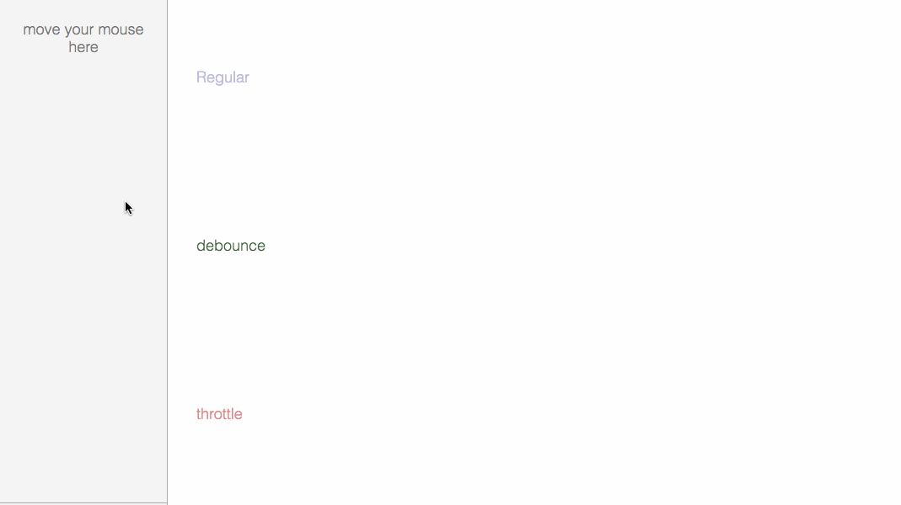

> 点击勘误[issues](https://github.com/webVueBlog/learn-web/issues)，哪吒感谢大家的阅读

[[toc]]

## 原理

防抖（`debounce`）：不管事件触发频率多高，一定在事件触发n秒后才执行，如果你在一个事件触发的 n 秒内又触发了这个事件，就以新的事件的时间为准，n秒后才执行，总之，触发完事件 n 秒内不再触发事件，n秒后再执行。



应用场景

## 窗口大小变化，调整样式

```js
window.addEventListener('resize', debounce(handleResize, 200));
```

## 搜索框，输入后1000毫秒搜索

```js
debounce(fetchSelectData, 300);
```

## 表单验证，输入1000毫秒后验证

```js
debounce(validator, 1000);
```

## 实现

注意考虑两个问题：

在debounce函数中返回一个闭包，这里用的普通function，里面的setTimeout则用的箭头函数，这样做的意义是让this的指向准确，this的真实指向并非debounce的调用者，而是返回闭包的调用者。

对传入闭包的参数进行透传。

```js
function debounce(event, time) {
  let timer = null;
  return function (...args) {
	clearTimeout(timer);
	timer = setTimeout(() => {
	  event.apply(this, args);
	}, time);
  };
}
```

有时候我们需要让函数立即执行一次，再等后面事件触发后等待n秒执行，我们给debounce函数一个flag用于标示是否立即执行。

当定时器变量timer为空时，说明是第一次执行，我们立即执行它。

```js
function debounce(event, time, flag) {
  let timer = null;
  return function (...args) {
	clearTimeout(timer);
	if (flag && !timer) {
	  event.apply(this, args);
	}
	timer = setTimeout(() => {
	  event.apply(this, args);
	}, time);
  };
}
```

