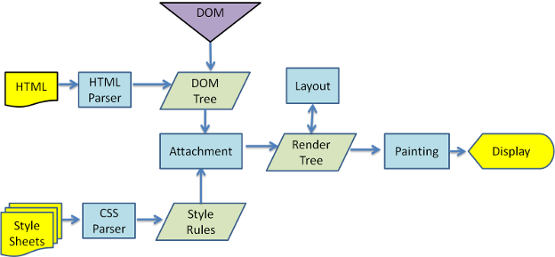

> 点击勘误[issues](https://github.com/webVueBlog/learn-web/issues)，哪吒感谢大家的阅读

[[toc]]

## 浏览器向服务器请求资源过程

1. 输入网址;
2. 浏览器查找域名的IP地址;
3. 浏览器给web服务器发送一个HTTP请求 ;
4. 网站服务的永久重定向响应 ;
5. 浏览器跟踪重定向地址知道了要访问的正确地址，所以它会发送另一个获取请求;
6. 服务器“处理”请求，服务器接收到获取请求，然后处理并返回一个响应;
7. 服务器发回一个HTML响应 ;
8. 浏览器开始渲染HTML，显示HTML
9. 浏览器发送请求，以获取嵌入在HTML中的对象,在浏览器显示HTML时，它会注意到需要获取其他地址内容的标签,这时，浏览器会发送一个获取请求来重新获得这些文件,这些文件就包括CSS/JS/图片等资源，这些资源的地址都要经历一个和HTML读取类似的过程,所以浏览器会在DNS中查找这些域名，发送请求，重定向等。

## 浏览器解析渲染流程

一、大致分为五步：

1. 解析HTML
2. 构建DOM树
3. DOM树与CSS样式进行附着构造呈现树
4. 布局
5. 绘制

二、解析渲染过程

1. DOM Tree：浏览器将HTML解析成树形的数据结构，构建一颗DOM树，同时进行第三步。
2. CSS Rule Tree：浏览器将CSS解析成树形的数据结构，构建CSSOM tree，生成页面的样式表。
3. Render Tree: 将DOM树和样式表，关联起来，构建一颗Render树(这一过程又称为Attachment)。每个DOM节点都有attach方法，接受样式信息，返回一个render对象(又名renderer)。这些render对象最终会被构建成一颗Render树。
4. layout: 有了Render Tree，浏览器已经能知道网页中有哪些节点、各个节点的CSS定义以及他们的从属关系，从而去计算出每个节点在屏幕中的位置。
5. painting: 按照算出来的规则，调用每个节点paint方法，把它们绘制出来。
6. reflow（回流or重排）：当浏览器发现某个部分发生了点变化影响了布局，需要倒回去重新渲染，这个回退的过程叫 reflow。reflow 会从 `<html>` 这个 root frame 开始递归往下，依次计算所有的结点几何尺寸和位置。reflow 几乎是无法避免的。现在界面上流行的一些效果，比如树状目录的折叠、展开（实质上是元素的显示与隐藏）等，都将引起浏览器的 reflow。鼠标滑过、点击……只要这些行为引起了页面上某些元素的占位面积、定位方式、边距等属性的变化，都会引起它内部、周围甚至整个页面的重新渲染。通常我们都无法预估浏览器到底会 reflow 哪一部分的代码，它们都彼此相互影响着。要从第四步重新开始，更加耗费性能。
7. repaint（重绘）：改变某个元素的背景色、文字颜色、边框颜色等等不影响它周围或内部布局的属性时，屏幕的一部分要重画，但是元素的几何尺寸没有变，只需要重新走第五步。

- 浏览器从服务端拿到html文件后，首先开始解析html文件，构建DOM tree，并且同时构建Render Tree；
- 遇到js文件的话，阻塞DOM tree的构建；因为js可能会改变dom和css，因此浏览器会先解析script，避免浪费。
- 遇到css文件的话，先加载css然后构建CSSOM Tree，与此同时构建DOM Tree， 但是将阻塞Render Tree的构建。
- 如果将css文件放在底部，render tree在之前就已经构建完了，因此用户可能会看到无样式的页面，或者闪屏。
- 重排意味着重新计算节点的位置大小等信息，重新在草稿本上画了草图，所以一定会重绘。重绘不一定会重排，比如背景颜色改变
- 重排和重绘代价很高，所以浏览器并不会一有信息改变就去执行重排和重绘，而是会将多个可能的重排和重绘一次执行。
- 有两个css属性，display: none和visibility: hidden，前者会导致重排和重绘，后者会导致重绘。这是后者的优点，但缺点是此节点一直保存在内存中，占用资源。

