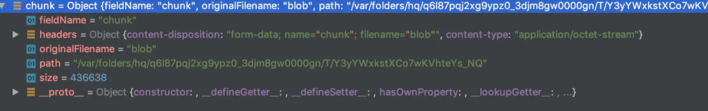
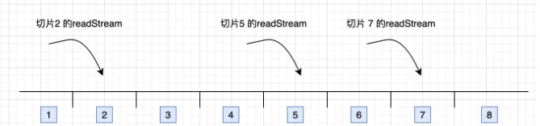

> 点击勘误[issues](https://github.com/webVueBlog/learn-web/issues)，哪吒感谢大家的阅读

[[toc]]

前端：vue element-ui

服务端：nodejs

核心是利用 Blob.prototype.slice 方法，和数组的 slice 方法相似，调用的 slice 方法可以返回原文件的某个切片

这样我们就可以根据预先设置好的切片最大数量将文件切分为一个个切片，然后借助 http 的可并发性，同时上传多个切片，这样从原本传一个大文件，变成了同时传多个小的文件切片，可以大大减少上传时间

另外由于是并发，传输到服务端的顺序可能会发生变化，所以我们还需要给每个切片记录顺序

## 服务端

服务端需要负责接受这些切片，并在接收到所有切片后合并切片

这里又引伸出两个问题

1. 何时合并切片，即切片什么时候传输完成
2. 如何合并切片

第一个问题需要前端进行配合，前端在每个切片中都携带切片最大数量的信息，当服务端接受到这个数量的切片时自动合并，也可以额外发一个请求主动通知服务端进行切片的合并

第二个问题，具体如何合并切片呢？这里可以使用 nodejs 的 读写流（readStream/writeStream），将所有切片的流传输到最终文件的流里

talk is cheap,show me the code，接着我们用代码实现上面的思路

## 前端部分

前端使用 Vue 作为开发框架，对界面没有太大要求，原生也可以，考虑到美观使用 element-ui 作为 UI 框架

## 上传控件

首先创建选择文件的控件，监听 change 事件以及上传按钮

<btn-upload/>

## 请求逻辑

考虑到通用性，这里没有用第三方的请求库，而是用原生 XMLHttpRequest 做一层简单的封装来发请求

```js
request({
      url,
      method = "post",
      data,
      headers = {},
      requestList
    }) {
      return new Promise(resolve => {
        const xhr = new XMLHttpRequest();
        xhr.open(method, url);
        Object.keys(headers).forEach(key =>
          xhr.setRequestHeader(key, headers[key])
        );
        xhr.send(data);
        xhr.onload = e => {
          resolve({
            data: e.target.response
          });
        };
      });
    }
```

## 上传切片

接着实现比较重要的上传功能，上传需要做两件事

- 对文件进行切片
- 将切片传输给服务端

```js
<template>
  <div>
    <input type="file" @change="handleFileChange" />
    <el-button @click="handleUpload">上传</el-button>
  </div>
</template>

<script>
+ const SIZE = 10 * 1024 * 1024; // 切片大小

export default {
  data: () => ({
    container: {
      file: null
    }，
+   data: []
  }),
  methods: {
    request() {},
    handleFileChange() {},
+    // 生成文件切片
+    createFileChunk(file, size = SIZE) {
+     const fileChunkList = [];
+      let cur = 0;
+      while (cur < file.size) {
+        fileChunkList.push({ file: file.slice(cur, cur + size) });
+        cur += size;
+      }
+      return fileChunkList;
+    },
+   // 上传切片
+    async uploadChunks() {
+      const requestList = this.data
+        .map(({ chunk，hash }) => {
+          const formData = new FormData();
+          formData.append("chunk", chunk);
+          formData.append("hash", hash);
+          formData.append("filename", this.container.file.name);
+          return { formData };
+        })
+        .map(async ({ formData }) =>
+          this.request({
+            url: "http://localhost:3000",
+            data: formData
+          })
+        );
+      await Promise.all(requestList); // 并发切片
+    },
+    async handleUpload() {
+      if (!this.container.file) return;
+      const fileChunkList = this.createFileChunk(this.container.file);
+      this.data = fileChunkList.map(({ file }，index) => ({
+        chunk: file,
+        hash: this.container.file.name + "-" + index // 文件名 + 数组下标
+      }));
+      await this.uploadChunks();
+    }
  }
};
</script>
```

当点击上传按钮时，调用 createFileChunk 将文件切片，切片数量通过文件大小控制，这里设置 10MB，也就是说 100 MB 的文件会被分成 10 个切片

createFileChunk 内使用 while 循环和 slice 方法将切片放入 fileChunkList 数组中返回

在生成文件切片时，需要给每个切片一个标识作为 hash，这里暂时使用文件名 + 下标，这样后端可以知道当前切片是第几个切片，用于之后的合并切片

随后调用 uploadChunks 上传所有的文件切片，将文件切片，切片 hash，以及文件名放入 FormData 中，再调用上一步的 request 函数返回一个 proimise，最后调用 Promise.all 并发上传所有的切片

## 发送合并请求

这里使用整体思路中提到的第二种合并切片的方式，即前端主动通知服务端进行合并，所以前端还需要额外发请求，服务端接受到这个请求时主动合并切片

```js
<template>
  <div>
    <input type="file" @change="handleFileChange" />
    <el-button @click="handleUpload">上传</el-button>
  </div>
</template>

<script>
export default {
  data: () => ({
    container: {
      file: null
    },
    data: []
  }),
  methods: {
    request() {},
    handleFileChange() {},
    createFileChunk() {},
    // 上传切片，同时过滤已上传的切片
    async uploadChunks() {
      const requestList = this.data
        .map(({ chunk，hash }) => {
          const formData = new FormData();
          formData.append("chunk", chunk);
          formData.append("hash", hash);
          formData.append("filename", this.container.file.name);
          return { formData };
        })
        .map(async ({ formData }) =>
          this.request({
            url: "http://localhost:3000",
            data: formData
          })
        );
      await Promise.all(requestList);
+      // 合并切片
+     await this.mergeRequest();
    },
+    async mergeRequest() {
+      await this.request({
+        url: "http://localhost:3000/merge",
+        headers: {
+          "content-type": "application/json"
+        },
+        data: JSON.stringify({
+          filename: this.container.file.name
+        })
+      });
+    },    
    async handleUpload() {}
  }
};
</script>
```

## 服务端部分

简单使用 http 模块搭建服务端

```js
const http = require("http");
const server = http.createServer();

server.on("request", async (req, res) => {
  res.setHeader("Access-Control-Allow-Origin", "*");
  res.setHeader("Access-Control-Allow-Headers", "*");
  if (req.method === "OPTIONS") {
    res.status = 200;
    res.end();
    return;
  }
});

server.listen(3000, () => console.log("正在监听 3000 端口"));
```

## 接受切片

使用 multiparty 包处理前端传来的 FormData

在 multiparty.parse 的回调中，files 参数保存了 FormData 中文件，fields 参数保存了 FormData 中非文件的字段

```js
const http = require("http");
const path = require("path");
const fse = require("fs-extra");
const multiparty = require("multiparty");

const server = http.createServer();
+ const UPLOAD_DIR = path.resolve(__dirname, "..", "target"); // 大文件存储目录

server.on("request", async (req, res) => {
  res.setHeader("Access-Control-Allow-Origin", "*");
  res.setHeader("Access-Control-Allow-Headers", "*");
  if (req.method === "OPTIONS") {
    res.status = 200;
    res.end();
    return;
  }

+  const multipart = new multiparty.Form();

+  multipart.parse(req, async (err, fields, files) => {
+    if (err) {
+      return;
+    }
+    const [chunk] = files.chunk;
+    const [hash] = fields.hash;
+    const [filename] = fields.filename;
+    const chunkDir = path.resolve(UPLOAD_DIR, filename);

+   // 切片目录不存在，创建切片目录
+    if (!fse.existsSync(chunkDir)) {
+      await fse.mkdirs(chunkDir);
+    }

+      // fs-extra 专用方法，类似 fs.rename 并且跨平台
+      // fs-extra 的 rename 方法 windows 平台会有权限问题
+      // https://github.com/meteor/meteor/issues/7852#issuecomment-255767835
+      await fse.move(chunk.path, `${chunkDir}/${hash}`);
+    res.end("received file chunk");
+  });
});

server.listen(3000, () => console.log("正在监听 3000 端口"));
```



查看 multiparty 处理后的 chunk 对象，path 是存储临时文件的路径，size 是临时文件大小，在 multiparty 文档中提到可以使用 fs.rename(由于我用的是 fs-extra，它的 rename 方法 windows 平台权限问题，所以换成了 fse.move) 移动临时文件，即移动文件切片

在接受文件切片时，需要先创建存储切片的文件夹，由于前端在发送每个切片时额外携带了唯一值 hash，所以以 hash 作为文件名，将切片从临时路径移动切片文件夹中，最后的结果如下

## 合并切片

在接收到前端发送的合并请求后，服务端将文件夹下的所有切片进行合并

```js
const http = require("http");
const path = require("path");
const fse = require("fs-extra");

const server = http.createServer();
const UPLOAD_DIR = path.resolve(__dirname, "..", "target"); // 大文件存储目录

+ const resolvePost = req =>
+   new Promise(resolve => {
+     let chunk = "";
+     req.on("data", data => {
+       chunk += data;
+     });
+     req.on("end", () => {
+       resolve(JSON.parse(chunk));
+     });
+   });

+ const pipeStream = (path, writeStream) =>
+  new Promise(resolve => {
+    const readStream = fse.createReadStream(path);
+    readStream.on("end", () => {
+      fse.unlinkSync(path);
+      resolve();
+    });
+    readStream.pipe(writeStream);
+  });

// 合并切片
+ const mergeFileChunk = async (filePath, filename, size) => {
+  const chunkDir = path.resolve(UPLOAD_DIR, filename);
+  const chunkPaths = await fse.readdir(chunkDir);
+  // 根据切片下标进行排序
+  // 否则直接读取目录的获得的顺序可能会错乱
+  chunkPaths.sort((a, b) => a.split("-")[1] - b.split("-")[1]);
+  await Promise.all(
+    chunkPaths.map((chunkPath, index) =>
+      pipeStream(
+        path.resolve(chunkDir, chunkPath),
+        // 指定位置创建可写流
+        fse.createWriteStream(filePath, {
+          start: index * size,
+          end: (index + 1) * size
+        })
+      )
+    )
+  );
+  fse.rmdirSync(chunkDir); // 合并后删除保存切片的目录
+};

server.on("request", async (req, res) => {
  res.setHeader("Access-Control-Allow-Origin", "*");
  res.setHeader("Access-Control-Allow-Headers", "*");
  if (req.method === "OPTIONS") {
    res.status = 200;
    res.end();
    return;
  }

+   if (req.url === "/merge") {
+     const data = await resolvePost(req);
+     const { filename,size } = data;
+     const filePath = path.resolve(UPLOAD_DIR, `${filename}`);
+     await mergeFileChunk(filePath, filename);
+     res.end(
+       JSON.stringify({
+         code: 0,
+         message: "file merged success"
+       })
+     );
+   }

});

server.listen(3000, () => console.log("正在监听 3000 端口"));
```

由于前端在发送合并请求时会携带文件名，服务端根据文件名可以找到上一步创建的切片文件夹

接着使用 fs.createWriteStream 创建一个可写流，可写流文件名就是切片文件夹名 + 后缀名组合而成

随后遍历整个切片文件夹，将切片通过 fs.createReadStream 创建可读流，传输合并到目标文件中

值得注意的是每次可读流都会传输到可写流的指定位置，这是通过 createWriteStream 的第二个参数 start/end 控制的，目的是能够并发合并多个可读流到可写流中，这样即使流的顺序不同也能传输到正确的位置，所以这里还需要让前端在请求的时候多提供一个 size 参数

```js
   async mergeRequest() {
      await this.request({
        url: "http://localhost:3000/merge",
        headers: {
          "content-type": "application/json"
        },
        data: JSON.stringify({
+         size: SIZE,
          filename: this.container.file.name
        })
      });
    },
```



其实也可以等上一个切片合并完后再合并下个切片，这样就不需要指定位置，但传输速度会降低，所以使用了并发合并的手段，接着只要保证每次合并完成后删除这个切片，等所有切片都合并完毕后最后删除切片文件夹即可

至此一个简单的大文件上传就完成了，接下来我们再此基础上扩展一些额外的功能

## 显示上传进度条

上传进度分两种，一个是每个切片的上传进度，另一个是整个文件的上传进度，而整个文件的上传进度是基于每个切片上传进度计算而来，所以我们先实现切片的上传进度

## 切片进度条

XMLHttpRequest 原生支持上传进度的监听，只需要监听 upload.onprogress 即可，我们在原来的 request 基础上传入 onProgress 参数，给 XMLHttpRequest 注册监听事件

```js
 // xhr
    request({
      url,
      method = "post",
      data,
      headers = {},
+      onProgress = e => e,
      requestList
    }) {
      return new Promise(resolve => {
        const xhr = new XMLHttpRequest();
+       xhr.upload.onprogress = onProgress;
        xhr.open(method, url);
        Object.keys(headers).forEach(key =>
          xhr.setRequestHeader(key, headers[key])
        );
        xhr.send(data);
        xhr.onload = e => {
          resolve({
            data: e.target.response
          });
        };
      });
    }
```

由于每个切片都需要触发独立的监听事件，所以还需要一个工厂函数，根据传入的切片返回不同的监听函数

在原先的前端上传逻辑中新增监听函数部分

```js
    // 上传切片，同时过滤已上传的切片
    async uploadChunks(uploadedList = []) {
      const requestList = this.data
+       .map(({ chunk,hash,index }) => {
          const formData = new FormData();
          formData.append("chunk", chunk);
          formData.append("hash", hash);
          formData.append("filename", this.container.file.name);
+         return { formData,index };
        })
+       .map(async ({ formData,index }) =>
          this.request({
            url: "http://localhost:3000",
            data: formData，
+           onProgress: this.createProgressHandler(this.data[index]),
          })
        );
      await Promise.all(requestList);
       // 合并切片
      await this.mergeRequest();
    },
    async handleUpload() {
      if (!this.container.file) return;
      const fileChunkList = this.createFileChunk(this.container.file);
      this.data = fileChunkList.map(({ file }，index) => ({
        chunk: file,
+       index,
        hash: this.container.file.name + "-" + index
+       percentage:0
      }));
      await this.uploadChunks();
    }    
+   createProgressHandler(item) {
+      return e => {
+        item.percentage = parseInt(String((e.loaded / e.total) * 100));
+      };
+    }
```

每个切片在上传时都会通过监听函数更新 data 数组对应元素的 percentage 属性，之后把将 data 数组放到视图中展示即可

## 文件进度条

将每个切片已上传的部分累加，除以整个文件的大小，就能得出当前文件的上传进度，所以这里使用 Vue 计算属性

```js
computed: {
   uploadPercentage() {
	  if (!this.container.file || !this.data.length) return 0;
	  const loaded = this.data
		.map(item => item.size * item.percentage)
		.reduce((acc, cur) => acc + cur);
	  return parseInt((loaded / this.container.file.size).toFixed(2));
	}
}
```

## 断点续传

断点续传的原理在于前端/服务端需要记住已上传的切片，这样下次上传就可以跳过之前已上传的部分，有两种方案实现记忆的功能

- 前端使用 localStorage 记录已上传的切片 hash
- 服务端保存已上传的切片 hash，前端每次上传前向服务端获取已上传的切片

第一种是前端的解决方案，第二种是服务端，而前端方案有一个缺陷，如果换了个浏览器就失去了记忆的效果，所以这里选取后者

## 生成 hash

无论是前端还是服务端，都必须要生成文件和切片的 hash，之前我们使用文件名 + 切片下标作为切片 hash，这样做文件名一旦修改就失去了效果，而事实上只要文件内容不变，hash 就不应该变化，所以正确的做法是根据文件内容生成 hash，所以我们修改一下 hash 的生成规则

这里用到另一个库 spark-md5，它可以根据文件内容计算出文件的 hash 值，另外考虑到如果上传一个超大文件，读取文件内容计算 hash 是非常耗费时间的，并且会引起 UI 的阻塞，导致页面假死状态，所以我们使用 web-worker 在 worker 线程计算 hash，这样用户仍可以在主界面正常的交互

由于实例化 web-worker 时，参数是一个 js 文件路径且不能跨域，所以我们单独创建一个 hash.js 文件放在 public 目录下，另外在 worker 中也是不允许访问 dom 的，但它提供了importScripts 函数用于导入外部脚本，通过它导入 spark-md5

```js
// /public/hash.js
self.importScripts("/spark-md5.min.js"); // 导入脚本

// 生成文件 hash
self.onmessage = e => {
  const { fileChunkList } = e.data;
  const spark = new self.SparkMD5.ArrayBuffer();
  let percentage = 0;
  let count = 0;
  const loadNext = index => {
    const reader = new FileReader();
    reader.readAsArrayBuffer(fileChunkList[index].file);
    reader.onload = e => {
      count++;
      spark.append(e.target.result);
      if (count === fileChunkList.length) {
        self.postMessage({
          percentage: 100,
          hash: spark.end()
        });
        self.close();
      } else {
        percentage += 100 / fileChunkList.length;
        self.postMessage({
          percentage
        });
        // 递归计算下一个切片
        loadNext(count);
      }
    };
  };
  loadNext(0);
};
```

在 worker 线程中，接受文件切片 fileChunkList，利用 FileReader 读取每个切片的 ArrayBuffer 并不断传入 spark-md5 中，每计算完一个切片通过 postMessage 向主线程发送一个进度事件，全部完成后将最终的 hash 发送给主线程

spark-md5 需要根据所有切片才能算出一个 hash 值，不能直接将整个文件放入计算，否则即使不同文件也会有相同的 hash，具体可以看官方文档

接着编写主线程与 worker 线程通讯的逻辑

```js
+	   // 生成文件 hash（web-worker）
+    calculateHash(fileChunkList) {
+      return new Promise(resolve => {
+       // 添加 worker 属性
+        this.container.worker = new Worker("/hash.js");
+        this.container.worker.postMessage({ fileChunkList });
+        this.container.worker.onmessage = e => {
+          const { percentage, hash } = e.data;
+          this.hashPercentage = percentage;
+          if (hash) {
+            resolve(hash);
+          }
+        };
+      });
    },
    async handleUpload() {
      if (!this.container.file) return;
      const fileChunkList = this.createFileChunk(this.container.file);
+     this.container.hash = await this.calculateHash(fileChunkList);
      this.data = fileChunkList.map(({ file }，index) => ({
+       fileHash: this.container.hash,
        chunk: file,
        hash: this.container.file.name + "-" + index, // 文件名 + 数组下标
        percentage:0
      }));
      await this.uploadChunks();
    }   
```

主线程使用 postMessage 给 worker 线程传入所有切片 fileChunkList，并监听 worker 线程发出的 postMessage 事件拿到文件 hash

## 文件秒传

在实现断点续传前先简单介绍一下文件秒传

所谓的文件秒传，即在服务端已经存在了上传的资源，所以当用户再次上传时会直接提示上传成功

文件秒传需要依赖上一步生成的 hash，即在上传前，先计算出文件 hash，并把 hash 发送给服务端进行验证，由于 hash 的唯一性，所以一旦服务端能找到 hash 相同的文件，则直接返回上传成功的信息即可

```js
+    async verifyUpload(filename, fileHash) {
+       const { data } = await this.request({
+         url: "http://localhost:3000/verify",
+         headers: {
+           "content-type": "application/json"
+         },
+         data: JSON.stringify({
+           filename,
+           fileHash
+         })
+       });
+       return JSON.parse(data);
+     },
   async handleUpload() {
      if (!this.container.file) return;
      const fileChunkList = this.createFileChunk(this.container.file);
      this.container.hash = await this.calculateHash(fileChunkList);
+     const { shouldUpload } = await this.verifyUpload(
+       this.container.file.name,
+       this.container.hash
+     );
+     if (!shouldUpload) {
+       this.$message.success("秒传：上传成功");
+       return;
+    }
     this.data = fileChunkList.map(({ file }, index) => ({
        fileHash: this.container.hash,
        index,
        hash: this.container.hash + "-" + index,
        chunk: file,
        percentage: 0
      }));
      await this.uploadChunks();
    }   
```

服务端的逻辑非常简单，新增一个验证接口，验证文件是否存在即可

```js
+ const extractExt = filename =>
+  filename.slice(filename.lastIndexOf("."), filename.length); // 提取后缀名
const UPLOAD_DIR = path.resolve(__dirname, "..", "target"); // 大文件存储目录

const resolvePost = req =>
  new Promise(resolve => {
    let chunk = "";
    req.on("data", data => {
      chunk += data;
    });
    req.on("end", () => {
      resolve(JSON.parse(chunk));
    });
  });

server.on("request", async (req, res) => {
  if (req.url === "/verify") {
+    const data = await resolvePost(req);
+    const { fileHash, filename } = data;
+    const ext = extractExt(filename);
+    const filePath = path.resolve(UPLOAD_DIR, `${fileHash}${ext}`);
+    if (fse.existsSync(filePath)) {
+      res.end(
+        JSON.stringify({
+          shouldUpload: false
+        })
+      );
+    } else {
+      res.end(
+        JSON.stringify({
+          shouldUpload: true
+        })
+      );
+    }
  }
});
server.listen(3000, () => console.log("正在监听 3000 端口"));
```

## 暂停上传

讲完了生成 hash 和文件秒传，回到断点续传

断点续传顾名思义即断点 + 续传，所以我们第一步先实现“断点”，也就是暂停上传

原理是使用 XMLHttpRequest 的 abort 方法，可以取消一个 xhr 请求的发送，为此我们需要将上传每个切片的 xhr 对象保存起来，我们再改造一下 request 方法

```js
   request({
      url,
      method = "post",
      data,
      headers = {},
      onProgress = e => e,
+     requestList
    }) {
      return new Promise(resolve => {
        const xhr = new XMLHttpRequest();
        xhr.upload.onprogress = onProgress;
        xhr.open(method, url);
        Object.keys(headers).forEach(key =>
          xhr.setRequestHeader(key, headers[key])
        );
        xhr.send(data);
        xhr.onload = e => {
+          // 将请求成功的 xhr 从列表中删除
+          if (requestList) {
+            const xhrIndex = requestList.findIndex(item => item === xhr);
+            requestList.splice(xhrIndex, 1);
+          }
          resolve({
            data: e.target.response
          });
        };
+        // 暴露当前 xhr 给外部
+        requestList?.push(xhr);
      });
    },
```

这样在上传切片时传入 requestList 数组作为参数，request 方法就会将所有的 xhr 保存在数组中了

每当一个切片上传成功时，将对应的 xhr 从 requestList 中删除，所以 requestList 中只保存正在上传切片的 xhr

之后新建一个暂停按钮，当点击按钮时，调用保存在 requestList 中 xhr 的 abort 方法，即取消并清空所有正在上传的切片

```js
 handlePause() {
    this.requestList.forEach(xhr => xhr?.abort());
    this.requestList = [];
}
```

## 恢复上传

之前在介绍断点续传的时提到使用第二种服务端存储的方式实现续传

由于当文件切片上传后，服务端会建立一个文件夹存储所有上传的切片，所以每次前端上传前可以调用一个接口，服务端将已上传的切片的切片名返回，前端再跳过这些已经上传切片，这样就实现了“续传”的效果

而这个接口可以和之前秒传的验证接口合并，前端每次上传前发送一个验证的请求，返回两种结果

- 服务端已存在该文件，不需要再次上传
- 服务端不存在该文件或者已上传部分文件切片，通知前端进行上传，并把已上传的文件切片返回给前端

所以我们改造一下之前文件秒传的服务端验证接口

```js
const extractExt = filename =>
  filename.slice(filename.lastIndexOf("."), filename.length); // 提取后缀名
const UPLOAD_DIR = path.resolve(__dirname, "..", "target"); // 大文件存储目录

const resolvePost = req =>
  new Promise(resolve => {
    let chunk = "";
    req.on("data", data => {
      chunk += data;
    });
    req.on("end", () => {
      resolve(JSON.parse(chunk));
    });
  });
  
+  // 返回已经上传切片名列表
+ const createUploadedList = async fileHash =>
+   fse.existsSync(path.resolve(UPLOAD_DIR, fileHash))
+    ? await fse.readdir(path.resolve(UPLOAD_DIR, fileHash))
+    : [];

server.on("request", async (req, res) => {
  if (req.url === "/verify") {
    const data = await resolvePost(req);
    const { fileHash, filename } = data;
    const ext = extractExt(filename);
    const filePath = path.resolve(UPLOAD_DIR, `${fileHash}${ext}`);
    if (fse.existsSync(filePath)) {
      res.end(
        JSON.stringify({
          shouldUpload: false
        })
      );
    } else {
      res.end(
        JSON.stringify({
          shouldUpload: true，
+         uploadedList: await createUploadedList(fileHash)
        })
      );
    }
  }
});
server.listen(3000, () => console.log("正在监听 3000 端口"));
```

接着回到前端，前端有两个地方需要调用验证的接口

- 点击上传时，检查是否需要上传和已上传的切片
- 点击暂停后的恢复上传，返回已上传的切片

新增恢复按钮并改造原来上传切片的逻辑

```js
<template>
  <div id="app">
      <input
        type="file"
        @change="handleFileChange"
      />
       <el-button @click="handleUpload">上传</el-button>
       <el-button @click="handlePause" v-if="isPaused">暂停</el-button>
+      <el-button @click="handleResume" v-else>恢复</el-button>
      //...
    </div>
</template>

+   async handleResume() {
+      const { uploadedList } = await this.verifyUpload(
+        this.container.file.name,
+        this.container.hash
+      );
+      await this.uploadChunks(uploadedList);
    },
    async handleUpload() {
      if (!this.container.file) return;
      const fileChunkList = this.createFileChunk(this.container.file);
      this.container.hash = await this.calculateHash(fileChunkList);

+     const { shouldUpload, uploadedList } = await this.verifyUpload(
        this.container.file.name,
        this.container.hash
      );
      if (!shouldUpload) {
        this.$message.success("秒传：上传成功");
        return;
      }

      this.data = fileChunkList.map(({ file }, index) => ({
        fileHash: this.container.hash,
        index,
        hash: this.container.hash + "-" + index,
        chunk: file，
        percentage: 0
      }));

+      await this.uploadChunks(uploadedList);
    },
   // 上传切片，同时过滤已上传的切片
+   async uploadChunks(uploadedList = []) {
      const requestList = this.data
+        .filter(({ hash }) => !uploadedList.includes(hash))
        .map(({ chunk, hash, index }) => {
          const formData = new FormData();
          formData.append("chunk", chunk);
          formData.append("hash", hash);
          formData.append("filename", this.container.file.name);
          formData.append("fileHash", this.container.hash);
          return { formData, index };
        })
        .map(async ({ formData, index }) =>
          this.request({
            url: "http://localhost:3000",
            data: formData,
            onProgress: this.createProgressHandler(this.data[index]),
            requestList: this.requestList
          })
        );
      await Promise.all(requestList);
      // 之前上传的切片数量 + 本次上传的切片数量 = 所有切片数量时
      // 合并切片
+      if (uploadedList.length + requestList.length === this.data.length) {
         await this.mergeRequest();
+      }
    }
```

这里给原来上传切片的函数新增 uploadedList 参数，即上图中服务端返回的切片名列表，通过 filter 过滤掉已上传的切片，并且由于新增了已上传的部分，所以之前合并接口的触发条件做了一些改动

到这里断点续传的功能基本完成了

## 进度条改进

虽然实现了断点续传，但还需要修改一下进度条的显示规则，否则在暂停上传/接收到已上传切片时的进度条会出现偏差

## 切片进度条

由于在点击上传/恢复上传时，会调用验证接口返回已上传的切片，所以需要将已上传切片的进度变成 100%

```js
   async handleUpload() {
      if (!this.container.file) return;
      const fileChunkList = this.createFileChunk(this.container.file);
      this.container.hash = await this.calculateHash(fileChunkList);
      const { shouldUpload, uploadedList } = await this.verifyUpload(
        this.container.file.name,
        this.container.hash
      );
      if (!shouldUpload) {
        this.$message.success("秒传：上传成功");
        return;
      }
      this.data = fileChunkList.map(({ file }, index) => ({
        fileHash: this.container.hash,
        index,
        hash: this.container.hash + "-" + index,
        chunk: file,
+       percentage: uploadedList.includes(index) ? 100 : 0
      }));
      await this.uploadChunks(uploadedList);
    },
```

uploadedList 会返回已上传的切片，在遍历所有切片时判断当前切片是否在已上传列表里即可

## 文件进度条

之前说到文件进度条是一个计算属性，根据所有切片的上传进度计算而来，这就遇到了一个问题

点击暂停会取消并清空切片的 xhr 请求，此时如果已经上传了一部分，就会发现文件进度条有倒退的现象

当点击恢复时，由于重新创建了 xhr 导致切片进度清零，所以总进度条就会倒退

解决方案是创建一个“假”的进度条，这个假进度条基于文件进度条，但只会停止和增加，然后给用户展示这个假的进度条

这里我们使用 Vue 的监听属性

```js
  data: () => ({
+    fakeUploadPercentage: 0
  }),
  computed: {
    uploadPercentage() {
      if (!this.container.file || !this.data.length) return 0;
      const loaded = this.data
        .map(item => item.size * item.percentage)
        .reduce((acc, cur) => acc + cur);
      return parseInt((loaded / this.container.file.size).toFixed(2));
    }
  },  
  watch: {
+    uploadPercentage(now) {
+      if (now > this.fakeUploadPercentage) {
+        this.fakeUploadPercentage = now;
+      }
    }
  },
```

当 uploadPercentage 即真的文件进度条增加时，fakeUploadPercentage 也增加，一旦文件进度条后退，假的进度条只需停止即可

至此一个大文件上传 + 断点续传的解决方案就完成了

