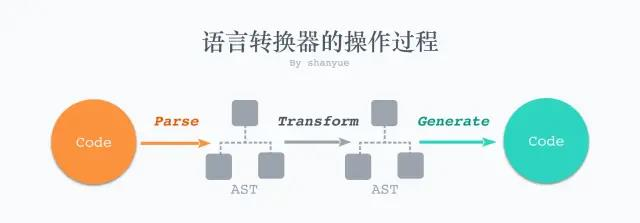
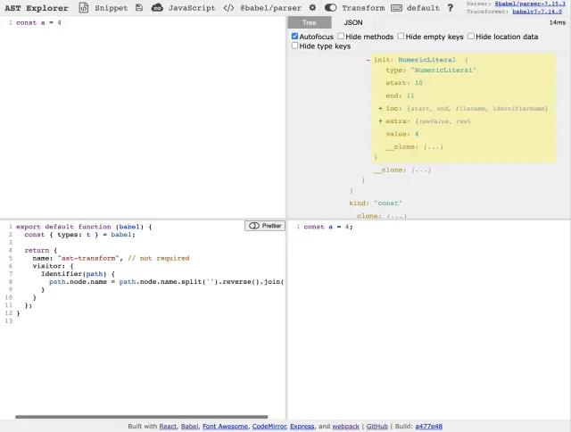
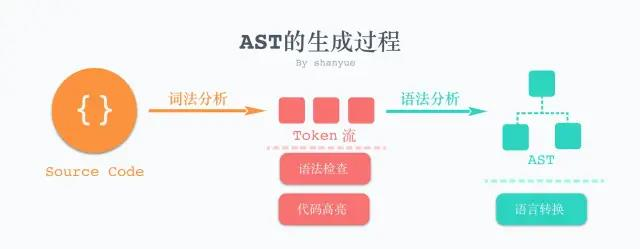

> 点击勘误[issues](https://github.com/webVueBlog/learn-web/issues)，哪吒感谢大家的阅读

[[toc]]

AST 是 Abstract Syntax Tree 的简称，是前端工程化绕不过的一个名词。它涉及到工程化诸多环节的应用，比如:

1. 如何将 Typescript 转化为 Javascript (typescript)
2. 如何将 SASS/LESS 转化为 CSS (sass/less)
3. 如何将 ES6+ 转化为 ES5 (babel)
4. 如何将 Javascript 代码进行格式化 (eslint/prettier)
5. 如何识别 React 项目中的 JSX (babel)
6. GraphQL、MDX、Vue SFC 等等

而在语言转换的过程中，实质上就是对其 AST 的操作，核心步骤就是 AST 三步走

1. Code -> AST (Parse)
2. AST -> AST (Transform)
3. AST -> Code (Generate)



以下是一段代码，及其对应的 AST

```js
// Code
const a = 4

// AST
{
  "type": "Program",
  "start": 0,
  "end": 11,
  "body": [
    {
      "type": "VariableDeclaration",
      "start": 0,
      "end": 11,
      "declarations": [
        {
          "type": "VariableDeclarator",
          "start": 6,
          "end": 11,
          "id": {
            "type": "Identifier",
            "start": 6,
            "end": 7,
            "name": "a"
          },
          "init": {
            "type": "Literal",
            "start": 10,
            "end": 11,
            "value": 4,
            "raw": "4"
          }
        }
      ],
      "kind": "const"
    }
  ],
  "sourceType": "module"
}
```

不同的语言拥有不同的解析器，比如 Javascript 的解析器和 CSS 的解析器就完全不同。

对相同的语言，也存在诸多的解析器，也就会生成多种 AST，如 babel 与 espree。

在 AST Explorer 中，列举了诸多语言的解析器(Parser)，及转化器(Transformer)。



## AST 的生成

AST 的生成这一步骤被称为「解析(Parser)」，而该步骤也有两个阶段: 词法分析(Lexical Analysis)和语法分析(Syntactic Analysis)

## 词法分析 (Lexical Analysis)

词法分析用以将代码转化为 Token 流，维护一个关于 Token 的数组



```js
// Code
a = 3

// Token
[
  { type: { ... }, value: "a", start: 0, end: 1, loc: { ... } },
  { type: { ... }, value: "=", start: 2, end: 3, loc: { ... } },
  { type: { ... }, value: "3", start: 4, end: 5, loc: { ... } },
  ...
]
```

词法分析后的 Token 流也有诸多应用，如:

1. 代码检查，如 eslint 判断是否以分号结尾，判断是否含有分号的 token
2. 语法高亮，如 highlight/prism 使之代码高亮
3. 模板语法，如 ejs 等模板也离不开

## 语法分析 (Syntactic Analysis)

语法分析将 Token 流转化为结构化的 AST，方便操作

```js
{
  "type": "Program",
  "start": 0,
  "end": 5,
  "body": [
    {
      "type": "ExpressionStatement",
      "start": 0,
      "end": 5,
      "expression": {
        "type": "AssignmentExpression",
        "start": 0,
        "end": 5,
        "operator": "=",
        "left": {
          "type": "Identifier",
          "start": 0,
          "end": 1,
          "name": "a"
        },
        "right": {
          "type": "Literal",
          "start": 4,
          "end": 5,
          "value": 3,
          "raw": "3"
        }
      }
    }
  ],
  "sourceType": "module"
}
```

## 实践

可通过自己写一个解析器，将语言 (DSL) 解析为 AST 进行练手，以下两个示例是不错的选择

1. 解析简单的 HTML 为 AST
2. 解析 Marktodwn List 为 AST